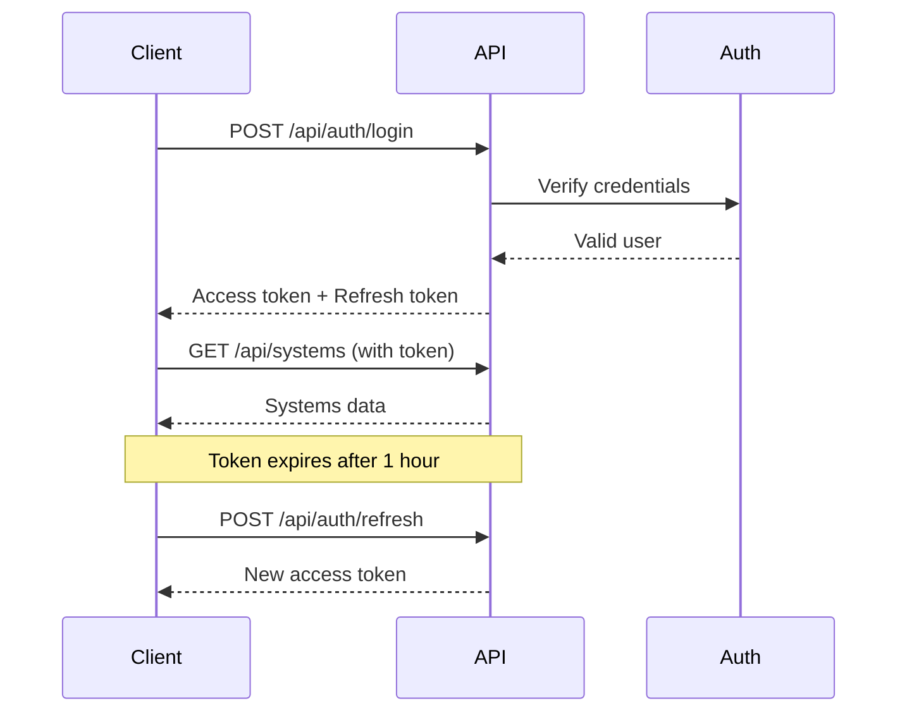

# API Documentation
## EU AI Act Implementation Lab

**Version:** 1.0
**Date:** December 24, 2025
**Base URL:** `https://api.euaiactlab.com` (Production)
**Base URL:** `http://localhost:3000` (Development)

---

## Table of Contents

1. [Overview](#overview)
2. [Authentication](#authentication)
3. [Common Patterns](#common-patterns)
4. [Authentication Endpoints](#authentication-endpoints)
5. [Organization Endpoints](#organization-endpoints)
6. [AI System Endpoints](#ai-system-endpoints)
7. [Classification Endpoints](#classification-endpoints)
8. [Gap Assessment Endpoints](#gap-assessment-endpoints)
9. [Governance Endpoints](#governance-endpoints)
10. [Risk Management Endpoints](#risk-management-endpoints)
11. [Technical Documentation Endpoints](#technical-documentation-endpoints)
12. [Training & Literacy Endpoints](#training--literacy-endpoints)
13. [Incident & Monitoring Endpoints](#incident--monitoring-endpoints)
14. [Export Endpoints](#export-endpoints)
15. [Error Codes](#error-codes)
16. [Rate Limiting](#rate-limiting)
17. [Webhooks](#webhooks)
18. [SDKs & Code Examples](#sdks--code-examples)

---

## Overview

### API Design Principles

- **RESTful**: Standard HTTP methods (GET, POST, PATCH, DELETE)
- **JSON**: All requests and responses use JSON
- **Stateless**: Each request contains all necessary information
- **Versioned**: API version in URL (`/api/v1/...`)
- **Paginated**: Large result sets use cursor-based pagination
- **Idempotent**: Safe to retry POST/PATCH requests with idempotency keys

### Request Format

```http
POST /api/v1/systems HTTP/1.1
Host: api.euaiactlab.com
Authorization: Bearer YOUR_ACCESS_TOKEN
Content-Type: application/json

{
  "name": "Fraud Detection System",
  "businessPurpose": "Detect fraudulent transactions"
}
```

### Response Format

**Success Response (200-299):**
```json
{
  "data": {
    "id": "sys_abc123",
    "name": "Fraud Detection System",
    "createdAt": "2025-12-24T10:30:00Z"
  },
  "meta": {
    "requestId": "req_xyz789"
  }
}
```

**Error Response (400-599):**
```json
{
  "error": {
    "code": "validation_error",
    "message": "Invalid request parameters",
    "details": [
      {
        "field": "name",
        "message": "Name is required"
      }
    ]
  },
  "meta": {
    "requestId": "req_xyz789"
  }
}
```

---

## Authentication

### Authentication Methods

1. **Email/Password**: Standard credentials-based auth
2. **OAuth 2.0**: Google, Microsoft sign-in
3. **API Keys**: For programmatic access (coming soon)

### Token Types

**Access Token:**
- Bearer token for API authentication
- Expires in 1 hour
- Included in `Authorization` header

**Refresh Token:**
- Long-lived token (7 days)
- Used to obtain new access tokens
- Stored in HTTP-only cookie

### Authentication Flow



---

## Common Patterns

### Pagination

**Request:**
```http
GET /api/v1/systems?limit=20&cursor=csr_abc123
```

**Response:**
```json
{
  "data": [...],
  "pagination": {
    "limit": 20,
    "nextCursor": "csr_def456",
    "hasMore": true
  }
}
```

### Filtering

```http
GET /api/v1/systems?filter[riskCategory]=HIGH_RISK&filter[status]=PRODUCTION
```

### Sorting

```http
GET /api/v1/systems?sort=-createdAt,name
```
- Prefix with `-` for descending order
- Multiple fields comma-separated

### Field Selection

```http
GET /api/v1/systems/sys_123?fields=id,name,riskClassification
```

### Including Related Resources

```http
GET /api/v1/systems/sys_123?include=riskClassification,gapAssessment
```

### Idempotency

```http
POST /api/v1/systems
Idempotency-Key: unique-key-123

{
  "name": "New System"
}
```

---

## Authentication Endpoints

### POST /api/auth/signup

Register a new user account.

**Request Body:**
```json
{
  "email": "user@example.com",
  "password": "SecurePass123!",
  "name": "Jane Doe"
}
```

**Validation:**
- `email`: Valid email format, unique
- `password`: Min 12 characters, complexity requirements
- `name`: 2-100 characters

**Response (201 Created):**
```json
{
  "data": {
    "user": {
      "id": "usr_abc123",
      "email": "user@example.com",
      "name": "Jane Doe",
      "emailVerified": null
    },
    "message": "Verification email sent to user@example.com"
  }
}
```

**Errors:**
- `400`: Validation error (weak password, invalid email)
- `409`: Email already registered

---

### POST /api/auth/login

Authenticate user and receive access token.

**Request Body:**
```json
{
  "email": "user@example.com",
  "password": "SecurePass123!"
}
```

**Response (200 OK):**
```json
{
  "data": {
    "user": {
      "id": "usr_abc123",
      "email": "user@example.com",
      "name": "Jane Doe",
      "role": "USER"
    },
    "accessToken": "eyJhbGciOiJIUzI1NiIs...",
    "expiresIn": 3600
  }
}
```

**Errors:**
- `401`: Invalid credentials
- `403`: Email not verified
- `429`: Too many login attempts (rate limited)

---

### POST /api/auth/verify-email

Verify user's email address.

**Request Body:**
```json
{
  "token": "verify_token_from_email"
}
```

**Response (200 OK):**
```json
{
  "data": {
    "message": "Email verified successfully"
  }
}
```

**Errors:**
- `400`: Invalid or expired token
- `404`: Token not found

---

### POST /api/auth/refresh

Refresh access token using refresh token.

**Request:**
- Refresh token in HTTP-only cookie

**Response (200 OK):**
```json
{
  "data": {
    "accessToken": "eyJhbGciOiJIUzI1NiIs...",
    "expiresIn": 3600
  }
}
```

**Errors:**
- `401`: Invalid or expired refresh token

---

### POST /api/auth/logout

Invalidate current session.

**Response (200 OK):**
```json
{
  "data": {
    "message": "Logged out successfully"
  }
}
```

---

### POST /api/auth/forgot-password

Request password reset email.

**Request Body:**
```json
{
  "email": "user@example.com"
}
```

**Response (200 OK):**
```json
{
  "data": {
    "message": "Password reset email sent if account exists"
  }
}
```

**Note:** Always returns success to prevent email enumeration.

---

### POST /api/auth/reset-password

Reset password with token from email.

**Request Body:**
```json
{
  "token": "reset_token_from_email",
  "newPassword": "NewSecurePass456!"
}
```

**Response (200 OK):**
```json
{
  "data": {
    "message": "Password reset successfully"
  }
}
```

---

## Organization Endpoints

### POST /api/v1/organizations

Create a new organization.

**Authentication:** Required

**Request Body:**
```json
{
  "name": "TechVision Analytics GmbH",
  "industry": "TECHNOLOGY",
  "region": "DE",
  "userRole": "COMPLIANCE_OFFICER",
  "logoUrl": "https://example.com/logo.png",
  "isDemo": false
}
```

**Response (201 Created):**
```json
{
  "data": {
    "id": "org_abc123",
    "name": "TechVision Analytics GmbH",
    "industry": "TECHNOLOGY",
    "region": "DE",
    "userRole": "COMPLIANCE_OFFICER",
    "logoUrl": "https://example.com/logo.png",
    "isDemo": false,
    "userId": "usr_abc123",
    "createdAt": "2025-12-24T10:00:00Z",
    "updatedAt": "2025-12-24T10:00:00Z"
  }
}
```

**Errors:**
- `400`: Validation error
- `401`: Unauthorized
- `409`: User already has an organization

---

### GET /api/v1/organizations/:id

Get organization details.

**Authentication:** Required
**Authorization:** User must own the organization

**Response (200 OK):**
```json
{
  "data": {
    "id": "org_abc123",
    "name": "TechVision Analytics GmbH",
    "industry": "TECHNOLOGY",
    "region": "DE",
    "userRole": "COMPLIANCE_OFFICER",
    "logoUrl": "https://example.com/logo.png",
    "isDemo": false,
    "createdAt": "2025-12-24T10:00:00Z",
    "updatedAt": "2025-12-24T10:00:00Z",
    "stats": {
      "aiSystemsCount": 4,
      "highRiskSystemsCount": 2,
      "overallReadiness": 72.5
    }
  }
}
```

**Errors:**
- `401`: Unauthorized
- `403`: Forbidden (not owner)
- `404`: Organization not found

---

### PATCH /api/v1/organizations/:id

Update organization details.

**Authentication:** Required
**Authorization:** User must own the organization

**Request Body (partial updates allowed):**
```json
{
  "name": "TechVision Analytics AG",
  "logoUrl": "https://example.com/new-logo.png"
}
```

**Response (200 OK):**
```json
{
  "data": {
    "id": "org_abc123",
    "name": "TechVision Analytics AG",
    "industry": "TECHNOLOGY",
    "region": "DE",
    "userRole": "COMPLIANCE_OFFICER",
    "logoUrl": "https://example.com/new-logo.png",
    "isDemo": false,
    "updatedAt": "2025-12-24T11:00:00Z"
  }
}
```

---

### DELETE /api/v1/organizations/:id

Delete organization and all associated data.

**Authentication:** Required
**Authorization:** User must own the organization

**Response (204 No Content)**

**Errors:**
- `401`: Unauthorized
- `403`: Forbidden (not owner)
- `404`: Organization not found

---

## AI System Endpoints

### GET /api/v1/systems

List all AI systems for the user's organization.

**Authentication:** Required

**Query Parameters:**
- `limit` (integer, default: 20, max: 100): Number of results per page
- `cursor` (string): Pagination cursor
- `filter[riskCategory]` (enum): Filter by risk category
  - Values: `PROHIBITED`, `HIGH_RISK`, `LIMITED_RISK`, `MINIMAL_RISK`
- `filter[deploymentStatus]` (enum): Filter by deployment status
  - Values: `PLANNING`, `DEVELOPMENT`, `TESTING`, `PRODUCTION`, `RETIRED`
- `search` (string): Search by system name or purpose
- `sort` (string): Sort order (e.g., `-createdAt`, `name`)

**Example Request:**
```http
GET /api/v1/systems?limit=10&filter[riskCategory]=HIGH_RISK&sort=-createdAt
```

**Response (200 OK):**
```json
{
  "data": [
    {
      "id": "sys_abc123",
      "name": "Fraud Detection System",
      "businessPurpose": "Detect fraudulent financial transactions",
      "deploymentStatus": "PRODUCTION",
      "riskClassification": {
        "category": "HIGH_RISK",
        "classificationDate": "2025-12-20T10:00:00Z"
      },
      "updatedAt": "2025-12-24T09:00:00Z"
    }
  ],
  "pagination": {
    "limit": 10,
    "nextCursor": "csr_def456",
    "hasMore": false
  },
  "meta": {
    "total": 4
  }
}
```

---

### POST /api/v1/systems

Create a new AI system.

**Authentication:** Required

**Request Body:**
```json
{
  "name": "Customer Service Chatbot",
  "businessPurpose": "Provide 24/7 customer support via chat interface",
  "primaryUsers": ["EXTERNAL_CUSTOMERS", "INTERNAL_EMPLOYEES"],
  "deploymentStatus": "DEVELOPMENT",
  "systemOwner": "Sarah Mitchell",
  "technicalContact": "john.doe@example.com",
  "dataCategories": ["PERSONAL_DATA", "BEHAVIORAL_DATA"],
  "integrationPoints": "Integrated with CRM and ticketing system"
}
```

**Validation:**
- `name`: Required, 2-100 characters, unique per organization
- `businessPurpose`: Required, 10-500 characters
- `primaryUsers`: Required, at least one value
- `deploymentStatus`: Required, valid enum value
- `dataCategories`: Required, at least one value

**Response (201 Created):**
```json
{
  "data": {
    "id": "sys_xyz789",
    "organizationId": "org_abc123",
    "name": "Customer Service Chatbot",
    "businessPurpose": "Provide 24/7 customer support via chat interface",
    "primaryUsers": ["EXTERNAL_CUSTOMERS", "INTERNAL_EMPLOYEES"],
    "deploymentStatus": "DEVELOPMENT",
    "systemOwner": "Sarah Mitchell",
    "technicalContact": "john.doe@example.com",
    "dataCategories": ["PERSONAL_DATA", "BEHAVIORAL_DATA"],
    "integrationPoints": "Integrated with CRM and ticketing system",
    "riskClassification": null,
    "createdAt": "2025-12-24T10:30:00Z",
    "updatedAt": "2025-12-24T10:30:00Z"
  }
}
```

**Errors:**
- `400`: Validation error
- `401`: Unauthorized
- `409`: System name already exists in organization

---

### GET /api/v1/systems/:id

Get detailed information about a specific AI system.

**Authentication:** Required
**Authorization:** System must belong to user's organization

**Query Parameters:**
- `include` (string): Comma-separated list of relations to include
  - Values: `riskClassification`, `gapAssessment`, `aiGovernance`, `aiRiskRegister`, `technicalDocumentation`, `incidents`, `monitoringIndicators`

**Example Request:**
```http
GET /api/v1/systems/sys_abc123?include=riskClassification,gapAssessment
```

**Response (200 OK):**
```json
{
  "data": {
    "id": "sys_abc123",
    "organizationId": "org_abc123",
    "name": "Fraud Detection System",
    "businessPurpose": "Detect fraudulent financial transactions in real-time",
    "primaryUsers": ["INTERNAL_EMPLOYEES"],
    "deploymentStatus": "PRODUCTION",
    "systemOwner": "Sarah Mitchell",
    "technicalContact": "marcus.chen@example.com",
    "dataCategories": ["FINANCIAL_DATA", "BEHAVIORAL_DATA"],
    "integrationPoints": "Payment gateway, transaction database",
    "riskClassification": {
      "id": "rc_abc123",
      "category": "HIGH_RISK",
      "prohibitedPractices": [],
      "highRiskCategories": ["Creditworthiness assessment"],
      "interactsWithPersons": true,
      "reasoning": "Used for creditworthiness assessment (Annex III)",
      "applicableRequirements": [
        "Risk management system (Article 9)",
        "Data governance (Article 10)",
        "Technical documentation (Article 11)",
        "Record-keeping (Article 12)",
        "Transparency (Article 13)",
        "Human oversight (Article 14)",
        "Accuracy, robustness, cybersecurity (Article 15)"
      ],
      "classificationDate": "2025-12-20T10:00:00Z"
    },
    "gapAssessment": {
      "id": "ga_abc123",
      "overallScore": 65.0,
      "lastAssessedDate": "2025-12-24T09:00:00Z",
      "requirementsCount": {
        "total": 25,
        "implemented": 16,
        "inProgress": 5,
        "notStarted": 4
      }
    },
    "createdAt": "2025-12-15T10:00:00Z",
    "updatedAt": "2025-12-24T09:00:00Z"
  }
}
```

---

### PATCH /api/v1/systems/:id

Update an AI system.

**Authentication:** Required
**Authorization:** System must belong to user's organization

**Request Body (partial updates):**
```json
{
  "deploymentStatus": "PRODUCTION",
  "systemOwner": "Jane Smith"
}
```

**Response (200 OK):**
```json
{
  "data": {
    "id": "sys_abc123",
    "name": "Fraud Detection System",
    "deploymentStatus": "PRODUCTION",
    "systemOwner": "Jane Smith",
    "updatedAt": "2025-12-24T11:00:00Z"
  }
}
```

---

### DELETE /api/v1/systems/:id

Delete an AI system and all related data.

**Authentication:** Required
**Authorization:** System must belong to user's organization

**Response (204 No Content)**

**Note:** This will cascade delete:
- Risk classification
- Gap assessment (and all requirements/evidence)
- Governance roles
- Risk register (and all risks/mitigations)
- Technical documentation
- Incidents
- Monitoring indicators

---

## Classification Endpoints

### POST /api/v1/systems/:systemId/classify

Classify an AI system's risk category.

**Authentication:** Required
**Authorization:** System must belong to user's organization

**Request Body:**
```json
{
  "prohibitedPractices": [],
  "highRiskCategories": [
    "Creditworthiness assessment",
    "Emergency services dispatch"
  ],
  "interactsWithPersons": true,
  "reasoning": "System is used for creditworthiness assessment and eligibility for financial services, which are listed in Annex III of the EU AI Act as high-risk applications.",
  "overrideApplied": false
}
```

**Response (201 Created):**
```json
{
  "data": {
    "id": "rc_abc123",
    "category": "HIGH_RISK",
    "prohibitedPractices": [],
    "highRiskCategories": [
      "Creditworthiness assessment",
      "Emergency services dispatch"
    ],
    "interactsWithPersons": true,
    "reasoning": "System is used for creditworthiness assessment...",
    "applicableRequirements": [
      "Risk management system (Article 9)",
      "Data governance (Article 10)",
      "Technical documentation (Article 11)",
      "Record-keeping (Article 12)",
      "Transparency (Article 13)",
      "Human oversight (Article 14)",
      "Accuracy, robustness, cybersecurity (Article 15)"
    ],
    "classificationDate": "2025-12-24T10:00:00Z",
    "overrideApplied": false,
    "overrideJustification": null
  }
}
```

**Classification Logic:**
1. If any `prohibitedPractices` selected → `PROHIBITED`
2. Else if any `highRiskCategories` selected → `HIGH_RISK`
3. Else if `interactsWithPersons` is true → `LIMITED_RISK`
4. Else → `MINIMAL_RISK`

---

### GET /api/v1/systems/:systemId/classification

Get current risk classification.

**Response (200 OK):**
```json
{
  "data": {
    "id": "rc_abc123",
    "category": "HIGH_RISK",
    "classificationDate": "2025-12-24T10:00:00Z",
    ...
  }
}
```

**Errors:**
- `404`: System not classified yet

---

### PATCH /api/v1/systems/:systemId/classification

Update risk classification (reclassification).

**Request Body:**
```json
{
  "highRiskCategories": ["Creditworthiness assessment"],
  "reasoning": "Removed emergency services dispatch use case",
  "overrideApplied": true,
  "overrideJustification": "Legal team determined this does not meet the threshold for emergency dispatch classification"
}
```

**Response (200 OK):**
```json
{
  "data": {
    "id": "rc_abc123",
    "category": "HIGH_RISK",
    "highRiskCategories": ["Creditworthiness assessment"],
    "overrideApplied": true,
    "overrideJustification": "Legal team determined...",
    "updatedAt": "2025-12-24T11:00:00Z"
  }
}
```

---

## Gap Assessment Endpoints

### GET /api/v1/systems/:systemId/gap-assessment

Get gap assessment for a system.

**Authentication:** Required

**Query Parameters:**
- `include` (string): `requirements` to include full requirement details

**Response (200 OK):**
```json
{
  "data": {
    "id": "ga_abc123",
    "aiSystemId": "sys_abc123",
    "overallScore": 65.0,
    "lastAssessedDate": "2025-12-24T09:00:00Z",
    "requirementsSummary": {
      "total": 25,
      "byStatus": {
        "IMPLEMENTED": 16,
        "IN_PROGRESS": 5,
        "NOT_STARTED": 4,
        "NOT_APPLICABLE": 0
      },
      "byCategory": {
        "RISK_MANAGEMENT": {
          "total": 4,
          "implemented": 2,
          "inProgress": 1,
          "notStarted": 1
        },
        "DATA_GOVERNANCE": {
          "total": 5,
          "implemented": 1,
          "inProgress": 2,
          "notStarted": 2
        }
      }
    }
  }
}
```

---

### GET /api/v1/systems/:systemId/gap-assessment/requirements

List all requirements for gap assessment.

**Query Parameters:**
- `filter[category]` (enum): Filter by requirement category
- `filter[status]` (enum): Filter by compliance status
- `filter[priority]` (enum): Filter by priority

**Response (200 OK):**
```json
{
  "data": [
    {
      "id": "req_abc123",
      "gapAssessmentId": "ga_abc123",
      "category": "RISK_MANAGEMENT",
      "title": "Risk management system established",
      "description": "Implement a continuous risk management system throughout the AI system lifecycle",
      "regulatoryReference": "Article 9",
      "status": "IMPLEMENTED",
      "priority": "CRITICAL",
      "notes": "Risk management framework documented in RMP-001",
      "assignedTo": "Marcus Chen",
      "dueDate": null,
      "evidenceCount": 2,
      "updatedAt": "2025-12-20T10:00:00Z",
      "updatedBy": "usr_abc123"
    }
  ],
  "meta": {
    "total": 25
  }
}
```

---

### PATCH /api/v1/systems/:systemId/gap-assessment/requirements/:requirementId

Update a requirement's status.

**Request Body:**
```json
{
  "status": "IN_PROGRESS",
  "notes": "Started implementing continuous monitoring processes",
  "assignedTo": "Jane Smith",
  "dueDate": "2026-01-31T23:59:59Z"
}
```

**Response (200 OK):**
```json
{
  "data": {
    "id": "req_abc123",
    "status": "IN_PROGRESS",
    "notes": "Started implementing continuous monitoring processes",
    "assignedTo": "Jane Smith",
    "dueDate": "2026-01-31T23:59:59Z",
    "updatedAt": "2025-12-24T10:30:00Z"
  }
}
```

---

### POST /api/v1/systems/:systemId/gap-assessment/requirements/:requirementId/evidence

Add evidence to a requirement.

**Request Body:**
```json
{
  "type": "FILE",
  "title": "Risk Management Policy v1.0",
  "description": "Comprehensive risk management policy covering AI systems",
  "fileUrl": "https://s3.example.com/org_abc123/evidence/rmp-001.pdf"
}
```

**Evidence Types:**
- `TEXT`: Text-based evidence
- `FILE`: Uploaded file (PDF, DOCX, etc.)
- `LINK`: URL to external resource

**For TEXT type:**
```json
{
  "type": "TEXT",
  "title": "Risk Assessment Completion",
  "description": "Initial risk assessment",
  "textContent": "We have completed the initial risk assessment for this system. Key findings: ..."
}
```

**For LINK type:**
```json
{
  "type": "LINK",
  "title": "Internal Policy Document",
  "description": "Link to company intranet policy",
  "linkUrl": "https://intranet.example.com/policies/ai-risk-management"
}
```

**Response (201 Created):**
```json
{
  "data": {
    "id": "evd_abc123",
    "requirementAssessmentId": "req_abc123",
    "type": "FILE",
    "title": "Risk Management Policy v1.0",
    "description": "Comprehensive risk management policy covering AI systems",
    "fileUrl": "https://s3.example.com/org_abc123/evidence/rmp-001.pdf",
    "uploadedBy": "usr_abc123",
    "uploadedAt": "2025-12-24T10:30:00Z"
  }
}
```

---

### DELETE /api/v1/systems/:systemId/gap-assessment/requirements/:requirementId/evidence/:evidenceId

Delete evidence from a requirement.

**Response (204 No Content)**

---

## Governance Endpoints

### GET /api/v1/systems/:systemId/governance

Get AI governance structure for a system.

**Response (200 OK):**
```json
{
  "data": {
    "id": "gov_abc123",
    "aiSystemId": "sys_abc123",
    "governanceStructure": "{\"type\":\"hierarchy\",\"nodes\":[...]}",
    "roles": [
      {
        "id": "role_abc123",
        "roleType": "SYSTEM_OWNER",
        "personName": "Sarah Mitchell",
        "email": "s.mitchell@example.com",
        "department": "Risk & Compliance",
        "responsibilities": [
          "Overall accountability for AI system",
          "Approval of major changes",
          "Escalation point for incidents",
          "Budget and resource allocation"
        ],
        "assignedDate": "2025-12-15T10:00:00Z",
        "isActive": true
      },
      {
        "id": "role_def456",
        "roleType": "RISK_OWNER",
        "personName": "Marcus Chen",
        "email": "m.chen@example.com",
        "department": "Enterprise Risk",
        "responsibilities": [
          "Risk assessment and monitoring",
          "Risk mitigation planning",
          "Risk reporting to governance board"
        ],
        "assignedDate": "2025-12-15T10:00:00Z",
        "isActive": true
      }
    ],
    "updatedAt": "2025-12-20T10:00:00Z"
  }
}
```

---

### POST /api/v1/systems/:systemId/governance/roles

Assign a governance role.

**Request Body:**
```json
{
  "roleType": "HUMAN_OVERSIGHT",
  "personName": "David Lee",
  "email": "d.lee@example.com",
  "department": "Operations",
  "responsibilities": [
    "Monitor AI system outputs",
    "Intervene when system confidence is low",
    "Review flagged cases daily",
    "Escalate issues to system owner"
  ]
}
```

**Response (201 Created):**
```json
{
  "data": {
    "id": "role_ghi789",
    "aiGovernanceId": "gov_abc123",
    "roleType": "HUMAN_OVERSIGHT",
    "personName": "David Lee",
    "email": "d.lee@example.com",
    "department": "Operations",
    "responsibilities": [...],
    "assignedDate": "2025-12-24T10:30:00Z",
    "isActive": true
  }
}
```

---

### PATCH /api/v1/systems/:systemId/governance/roles/:roleId

Update a governance role.

**Request Body:**
```json
{
  "personName": "David Lee Jr.",
  "email": "d.lee.jr@example.com",
  "responsibilities": [
    "Monitor AI system outputs",
    "Intervene when system confidence is low",
    "Review flagged cases daily",
    "Escalate issues to system owner",
    "Quarterly effectiveness reviews"
  ]
}
```

**Response (200 OK):**
```json
{
  "data": {
    "id": "role_ghi789",
    "personName": "David Lee Jr.",
    "email": "d.lee.jr@example.com",
    "responsibilities": [...],
    "updatedAt": "2025-12-24T11:00:00Z"
  }
}
```

---

### DELETE /api/v1/systems/:systemId/governance/roles/:roleId

Remove a governance role assignment (soft delete - sets isActive = false).

**Response (204 No Content)**

---

## Risk Management Endpoints

### GET /api/v1/systems/:systemId/risks

Get all risks for an AI system.

**Query Parameters:**
- `filter[type]` (enum): Filter by risk type
- `filter[riskLevel]` (enum): Filter by risk level (LOW, MEDIUM, HIGH)
- `include` (string): Include related data (`mitigationActions`, `humanOversight`)

**Response (200 OK):**
```json
{
  "data": {
    "id": "rr_abc123",
    "aiSystemId": "sys_abc123",
    "lastAssessedDate": "2025-12-24T09:00:00Z",
    "assessedBy": "Marcus Chen",
    "risks": [
      {
        "id": "risk_abc123",
        "title": "Bias in fraud detection against demographic groups",
        "type": "BIAS",
        "description": "Training data may not represent diverse customer demographics...",
        "affectedStakeholders": ["External customers", "Compliance team"],
        "potentialImpact": "Higher false positive rates for certain groups leading to discrimination",
        "likelihood": 4,
        "impact": 5,
        "inherentRiskScore": 20,
        "riskLevel": "HIGH",
        "treatmentDecision": "MITIGATE",
        "treatmentJustification": null,
        "residualLikelihood": 2,
        "residualImpact": 4,
        "residualRiskScore": 8,
        "mitigationActionsCount": 2,
        "createdAt": "2025-12-15T10:00:00Z",
        "updatedAt": "2025-12-24T09:00:00Z"
      }
    ]
  }
}
```

---

### POST /api/v1/systems/:systemId/risks

Create a new risk.

**Request Body:**
```json
{
  "title": "Model accuracy degradation over time",
  "type": "SAFETY",
  "description": "Machine learning model may degrade in accuracy as data distribution changes over time (concept drift)",
  "affectedStakeholders": ["Customers", "Operations team", "Compliance"],
  "potentialImpact": "Increased false negatives leading to undetected fraud",
  "likelihood": 3,
  "impact": 4
}
```

**Validation:**
- `title`: Required, 5-100 characters
- `type`: Required, valid enum
- `likelihood`: Required, 1-5
- `impact`: Required, 1-5

**Response (201 Created):**
```json
{
  "data": {
    "id": "risk_def456",
    "riskRegisterId": "rr_abc123",
    "title": "Model accuracy degradation over time",
    "type": "SAFETY",
    "description": "Machine learning model may degrade...",
    "affectedStakeholders": ["Customers", "Operations team", "Compliance"],
    "potentialImpact": "Increased false negatives leading to undetected fraud",
    "likelihood": 3,
    "impact": 4,
    "inherentRiskScore": 12,
    "riskLevel": "MEDIUM",
    "treatmentDecision": null,
    "createdBy": "usr_abc123",
    "createdAt": "2025-12-24T10:30:00Z"
  }
}
```

**Risk Level Calculation:**
- Score = Likelihood × Impact
- LOW: 1-6
- MEDIUM: 8-12
- HIGH: 15-25

---

### PATCH /api/v1/systems/:systemId/risks/:riskId

Update a risk (typically for residual risk assessment).

**Request Body:**
```json
{
  "treatmentDecision": "MITIGATE",
  "residualLikelihood": 2,
  "residualImpact": 3
}
```

**Response (200 OK):**
```json
{
  "data": {
    "id": "risk_def456",
    "treatmentDecision": "MITIGATE",
    "residualLikelihood": 2,
    "residualImpact": 3,
    "residualRiskScore": 6,
    "updatedAt": "2025-12-24T11:00:00Z"
  }
}
```

---

### POST /api/v1/systems/:systemId/risks/:riskId/mitigations

Add a mitigation action to a risk.

**Request Body:**
```json
{
  "description": "Implement quarterly model retraining with updated data",
  "responsibleParty": "Data Science Team",
  "dueDate": "2026-03-31T23:59:59Z"
}
```

**Response (201 Created):**
```json
{
  "data": {
    "id": "mit_abc123",
    "riskId": "risk_def456",
    "description": "Implement quarterly model retraining with updated data",
    "responsibleParty": "Data Science Team",
    "dueDate": "2026-03-31T23:59:59Z",
    "status": "PLANNED",
    "effectivenessRating": null,
    "completionDate": null,
    "createdAt": "2025-12-24T10:30:00Z"
  }
}
```

---

### PATCH /api/v1/systems/:systemId/risks/:riskId/mitigations/:mitigationId

Update mitigation action status.

**Request Body:**
```json
{
  "status": "COMPLETED",
  "completionDate": "2025-12-24T10:00:00Z",
  "effectivenessRating": 4,
  "notes": "Model retraining pipeline established and first cycle completed"
}
```

**Response (200 OK):**
```json
{
  "data": {
    "id": "mit_abc123",
    "status": "COMPLETED",
    "completionDate": "2025-12-24T10:00:00Z",
    "effectivenessRating": 4,
    "notes": "Model retraining pipeline established...",
    "updatedAt": "2025-12-24T10:30:00Z"
  }
}
```

---

### POST /api/v1/systems/:systemId/risks/:riskId/oversight

Define human oversight measures for a risk.

**Request Body:**
```json
{
  "monitoringFrequency": "DAILY",
  "oversightMethod": "Automated bias metrics dashboard reviewed daily by risk team",
  "escalationTriggers": [
    "Bias metric exceeds 0.10 threshold",
    "False positive rate variance > 5% between groups",
    "Customer complaints received"
  ],
  "overrideCapability": true,
  "responsiblePerson": "Marcus Chen",
  "effectivenessNotes": "Daily review prevents issues from persisting"
}
```

**Response (201 Created):**
```json
{
  "data": {
    "id": "ho_abc123",
    "riskId": "risk_abc123",
    "monitoringFrequency": "DAILY",
    "oversightMethod": "Automated bias metrics dashboard...",
    "escalationTriggers": [...],
    "overrideCapability": true,
    "responsiblePerson": "Marcus Chen",
    "effectivenessNotes": "Daily review prevents issues from persisting",
    "createdAt": "2025-12-24T10:30:00Z"
  }
}
```

---

## Technical Documentation Endpoints

### GET /api/v1/systems/:systemId/documentation

Get technical documentation for a system.

**Response (200 OK):**
```json
{
  "data": {
    "id": "doc_abc123",
    "aiSystemId": "sys_abc123",
    "version": "1.2",
    "versionDate": "2025-12-24T09:00:00Z",
    "versionNotes": "Added cybersecurity section",
    "completenessPercentage": 75.0,
    "sections": {
      "intendedUse": "The Fraud Detection System is designed to identify...",
      "foreseeableMisuse": "Potential misuse includes...",
      "systemArchitecture": "The system uses a ensemble of machine learning models...",
      "trainingData": "Training data consists of 5 million historical transactions...",
      "modelPerformance": "Current model achieves 94.2% accuracy...",
      "validationTesting": "Validation approach includes...",
      "humanOversightDoc": "Human oversight is implemented through...",
      "cybersecurity": "Security measures include..."
    },
    "preparedBy": "usr_abc123",
    "reviewedBy": "usr_def456",
    "approvedBy": null,
    "approvalDate": null,
    "attachmentsCount": 3,
    "updatedAt": "2025-12-24T09:00:00Z"
  }
}
```

---

### PATCH /api/v1/systems/:systemId/documentation

Update technical documentation sections.

**Request Body:**
```json
{
  "intendedUse": "Updated intended use description...",
  "cybersecurity": "Enhanced cybersecurity section with new measures...",
  "versionNotes": "Updated intended use and cybersecurity sections"
}
```

**Response (200 OK):**
```json
{
  "data": {
    "id": "doc_abc123",
    "version": "1.3",
    "versionDate": "2025-12-24T11:00:00Z",
    "versionNotes": "Updated intended use and cybersecurity sections",
    "completenessPercentage": 80.0,
    "updatedAt": "2025-12-24T11:00:00Z"
  }
}
```

---

### GET /api/v1/systems/:systemId/documentation/versions

Get version history of technical documentation.

**Response (200 OK):**
```json
{
  "data": [
    {
      "id": "ver_abc123",
      "version": "1.3",
      "versionDate": "2025-12-24T11:00:00Z",
      "versionNotes": "Updated intended use and cybersecurity sections",
      "savedBy": "usr_abc123",
      "savedByName": "Sarah Mitchell"
    },
    {
      "id": "ver_def456",
      "version": "1.2",
      "versionDate": "2025-12-24T09:00:00Z",
      "versionNotes": "Added cybersecurity section",
      "savedBy": "usr_abc123",
      "savedByName": "Sarah Mitchell"
    }
  ]
}
```

---

### POST /api/v1/systems/:systemId/documentation/attachments

Upload an attachment to technical documentation.

**Request Body (multipart/form-data):**
```
file: [binary file data]
section: "SYSTEM_ARCHITECTURE"
description: "High-level architecture diagram"
```

**Response (201 Created):**
```json
{
  "data": {
    "id": "att_abc123",
    "technicalDocumentationId": "doc_abc123",
    "fileName": "architecture-diagram.pdf",
    "fileType": "application/pdf",
    "fileSize": 2457600,
    "fileUrl": "https://s3.example.com/org_abc123/attachments/att_abc123.pdf",
    "section": "SYSTEM_ARCHITECTURE",
    "description": "High-level architecture diagram",
    "uploadedBy": "usr_abc123",
    "uploadedAt": "2025-12-24T10:30:00Z"
  }
}
```

---

## Training & Literacy Endpoints

### GET /api/v1/training/records

Get training records for the organization.

**Query Parameters:**
- `filter[role]` (string): Filter by role
- `filter[status]` (enum): Filter by training status
- `filter[personName]` (string): Search by person name

**Response (200 OK):**
```json
{
  "data": [
    {
      "id": "tr_abc123",
      "organizationId": "org_abc123",
      "personName": "John Smith",
      "role": "Operations",
      "topicId": "topic_123",
      "topicName": "Incident Response Procedures",
      "completionDate": "2025-11-30T10:00:00Z",
      "trainingMethod": "ONLINE_COURSE",
      "durationHours": 2.5,
      "status": "COMPLETED",
      "selfAttested": true,
      "approvedBy": "usr_abc123",
      "approvalDate": "2025-12-01T09:00:00Z",
      "nextDueDate": "2026-11-30T23:59:59Z"
    }
  ],
  "meta": {
    "total": 157,
    "completionRate": 68.2
  }
}
```

---

### POST /api/v1/training/records

Create a training record (self-attestation or import).

**Request Body:**
```json
{
  "personName": "Jane Doe",
  "role": "Product Manager",
  "topicId": "topic_456",
  "topicName": "AI Ethics and Bias",
  "completionDate": "2025-12-20T10:00:00Z",
  "trainingMethod": "WORKSHOP",
  "durationHours": 4.0,
  "selfAttested": true,
  "notes": "Attended company-wide AI ethics workshop"
}
```

**Response (201 Created):**
```json
{
  "data": {
    "id": "tr_def456",
    "organizationId": "org_abc123",
    "personName": "Jane Doe",
    "role": "Product Manager",
    "topicId": "topic_456",
    "topicName": "AI Ethics and Bias",
    "completionDate": "2025-12-20T10:00:00Z",
    "trainingMethod": "WORKSHOP",
    "durationHours": 4.0,
    "status": "COMPLETED",
    "selfAttested": true,
    "approvedBy": null,
    "approvalDate": null,
    "createdAt": "2025-12-24T10:30:00Z"
  }
}
```

---

### GET /api/v1/training/dashboard

Get training compliance dashboard data.

**Response (200 OK):**
```json
{
  "data": {
    "overallCompletionRate": 68.2,
    "completionByRole": {
      "Executives": {
        "completed": 11,
        "total": 13,
        "percentage": 84.6
      },
      "Product Teams": {
        "completed": 18,
        "total": 25,
        "percentage": 72.0
      },
      "Development Teams": {
        "completed": 32,
        "total": 49,
        "percentage": 65.3
      },
      "Operations": {
        "completed": 7,
        "total": 12,
        "percentage": 58.3
      },
      "All Staff": {
        "completed": 89,
        "total": 171,
        "percentage": 52.0
      }
    },
    "overdueRecords": [
      {
        "personName": "John Smith",
        "role": "Operations",
        "topicName": "Incident Response",
        "dueDate": "2025-11-30T23:59:59Z"
      }
    ],
    "trendData": [
      {
        "month": "2025-09",
        "completionRate": 20.0
      },
      {
        "month": "2025-10",
        "completionRate": 35.0
      },
      {
        "month": "2025-11",
        "completionRate": 52.0
      },
      {
        "month": "2025-12",
        "completionRate": 68.2
      }
    ]
  }
}
```

---

## Incident & Monitoring Endpoints

### GET /api/v1/incidents

Get all incidents.

**Query Parameters:**
- `filter[systemId]` (string): Filter by AI system
- `filter[severity]` (enum): Filter by severity
- `filter[status]` (enum): Filter by status
- `filter[from]` (ISO date): Date range start
- `filter[to]` (ISO date): Date range end

**Response (200 OK):**
```json
{
  "data": [
    {
      "id": "inc_abc123",
      "incidentNumber": "INC-2025-003",
      "aiSystemId": "sys_abc123",
      "aiSystemName": "Fraud Detection System",
      "title": "Bias detected in fraud scoring for demographic group",
      "incidentDate": "2025-12-15T14:32:00Z",
      "reportedDate": "2025-12-15T14:35:00Z",
      "reportedBy": "Marcus Chen",
      "severity": "CRITICAL",
      "impact": "1,247 customer transactions affected",
      "status": "INVESTIGATING",
      "notificationRequired": true,
      "actionItemsCount": 3,
      "updatedAt": "2025-12-20T10:00:00Z"
    }
  ],
  "meta": {
    "total": 8,
    "summary": {
      "bySeverity": {
        "CRITICAL": 1,
        "HIGH": 2,
        "MEDIUM": 3,
        "LOW": 2
      },
      "byStatus": {
        "OPEN": 2,
        "INVESTIGATING": 3,
        "RESOLVED": 2,
        "CLOSED": 1
      }
    }
  }
}
```

---

### POST /api/v1/incidents

Report a new incident.

**Request Body:**
```json
{
  "aiSystemId": "sys_abc123",
  "title": "Unexpected model behavior in edge case",
  "incidentDate": "2025-12-24T15:30:00Z",
  "description": "Model produced unexpected outputs when processing transactions from a new geographic region not represented in training data",
  "severity": "HIGH",
  "impact": "23 transactions incorrectly flagged as fraudulent",
  "affectedUsers": "Customers in Nordic region",
  "rootCause": "Training data geographic bias",
  "immediateActions": "Manually reviewed flagged transactions and cleared false positives. Disabled automated flagging for Nordic region pending model update."
}
```

**Response (201 Created):**
```json
{
  "data": {
    "id": "inc_def456",
    "incidentNumber": "INC-2025-004",
    "aiSystemId": "sys_abc123",
    "title": "Unexpected model behavior in edge case",
    "incidentDate": "2025-12-24T15:30:00Z",
    "reportedDate": "2025-12-24T15:45:00Z",
    "reportedBy": "usr_abc123",
    "severity": "HIGH",
    "status": "OPEN",
    "notificationRequired": false,
    "createdAt": "2025-12-24T15:45:00Z"
  }
}
```

**Note:** Incident number auto-generated in format: `INC-YYYY-NNN`

---

### PATCH /api/v1/incidents/:id

Update incident status and details.

**Request Body:**
```json
{
  "status": "RESOLVED",
  "resolutionSummary": "Model retrained with expanded geographic dataset including Nordic region data. Validation testing shows improved performance.",
  "lessonsLearned": "Need to ensure training data represents all geographic regions where system will be deployed. Implement geographic coverage checks in data validation pipeline.",
  "resolvedDate": "2025-12-24T18:00:00Z"
}
```

**Response (200 OK):**
```json
{
  "data": {
    "id": "inc_def456",
    "status": "RESOLVED",
    "resolutionSummary": "Model retrained with expanded...",
    "lessonsLearned": "Need to ensure training data represents...",
    "resolvedDate": "2025-12-24T18:00:00Z",
    "updatedAt": "2025-12-24T18:00:00Z"
  }
}
```

---

### POST /api/v1/incidents/:id/actions

Add action item to an incident.

**Request Body:**
```json
{
  "description": "Expand training dataset with Nordic region transaction data",
  "assignedTo": "Data Science Team",
  "dueDate": "2026-01-15T23:59:59Z"
}
```

**Response (201 Created):**
```json
{
  "data": {
    "id": "action_abc123",
    "incidentId": "inc_def456",
    "description": "Expand training dataset with Nordic region transaction data",
    "assignedTo": "Data Science Team",
    "dueDate": "2026-01-15T23:59:59Z",
    "status": "PLANNED",
    "createdAt": "2025-12-24T16:00:00Z"
  }
}
```

---

### GET /api/v1/systems/:systemId/monitoring

Get monitoring indicators for a system.

**Response (200 OK):**
```json
{
  "data": [
    {
      "id": "ind_abc123",
      "aiSystemId": "sys_abc123",
      "name": "Model Accuracy",
      "category": "ACCURACY",
      "description": "Overall model accuracy on validation set",
      "measurementMethod": "Automated daily validation on holdout dataset",
      "targetValue": 95.0,
      "thresholdValue": 95.0,
      "alertCondition": "BELOW_THRESHOLD",
      "reviewFrequency": "DAILY",
      "unit": "percentage",
      "isActive": true,
      "currentValue": 94.2,
      "lastMeasuredDate": "2025-12-24T02:00:00Z",
      "status": "BELOW_TARGET",
      "trend": "DECLINING"
    }
  ]
}
```

---

### POST /api/v1/systems/:systemId/monitoring

Create a new monitoring indicator.

**Request Body:**
```json
{
  "name": "Bias Metric (Demographic Parity)",
  "category": "BIAS",
  "description": "Measures difference in positive outcome rates between demographic groups",
  "measurementMethod": "Automated calculation on daily transaction data",
  "targetValue": 0.05,
  "thresholdValue": 0.05,
  "alertCondition": "ABOVE_THRESHOLD",
  "reviewFrequency": "DAILY",
  "unit": "ratio"
}
```

**Response (201 Created):**
```json
{
  "data": {
    "id": "ind_def456",
    "aiSystemId": "sys_abc123",
    "name": "Bias Metric (Demographic Parity)",
    "category": "BIAS",
    "targetValue": 0.05,
    "thresholdValue": 0.05,
    "alertCondition": "ABOVE_THRESHOLD",
    "isActive": true,
    "createdAt": "2025-12-24T10:30:00Z"
  }
}
```

---

### POST /api/v1/systems/:systemId/monitoring/:indicatorId/values

Record a new indicator value.

**Request Body:**
```json
{
  "value": 0.08,
  "measurementDate": "2025-12-24T02:00:00Z",
  "notes": "Elevated bias metric detected, investigating cause"
}
```

**Response (201 Created):**
```json
{
  "data": {
    "id": "val_abc123",
    "indicatorId": "ind_def456",
    "value": 0.08,
    "measurementDate": "2025-12-24T02:00:00Z",
    "recordedBy": "usr_abc123",
    "notes": "Elevated bias metric detected, investigating cause",
    "alertTriggered": true,
    "relatedIncidentId": "inc_abc123"
  }
}
```

**Note:** If value crosses threshold and `alertCondition` is met, `alertTriggered` is set to true.

---

## Export Endpoints

### POST /api/v1/export/executive-summary

Generate executive summary PDF.

**Request Body:**
```json
{
  "organizationId": "org_abc123",
  "includeSystems": ["sys_abc123", "sys_def456"],
  "format": "pdf"
}
```

**Response (200 OK):**
```json
{
  "data": {
    "fileUrl": "https://s3.example.com/org_abc123/exports/executive-summary-20251224.pdf?signature=...",
    "expiresAt": "2025-12-31T23:59:59Z",
    "fileSize": 2457600,
    "tokensUsed": 3245
  }
}
```

**Processing Time:** ~15-20 seconds

---

### POST /api/v1/export/gap-analysis

Generate gap analysis report.

**Request Body:**
```json
{
  "systemId": "sys_abc123",
  "format": "pdf"
}
```

**Response (200 OK):**
```json
{
  "data": {
    "fileUrl": "https://s3.example.com/org_abc123/exports/gap-analysis-sys_abc123-20251224.pdf?signature=...",
    "expiresAt": "2025-12-31T23:59:59Z",
    "fileSize": 1843200,
    "tokensUsed": 2156
  }
}
```

---

### POST /api/v1/export/risk-assessment

Generate risk assessment report.

**Request Body:**
```json
{
  "systemId": "sys_abc123",
  "format": "pdf"
}
```

**Response (200 OK):**
```json
{
  "data": {
    "fileUrl": "https://s3.example.com/org_abc123/exports/risk-assessment-sys_abc123-20251224.pdf?signature=...",
    "expiresAt": "2025-12-31T23:59:59Z",
    "fileSize": 2156800,
    "tokensUsed": 2847
  }
}
```

---

### POST /api/v1/export/full-package

Generate complete documentation package.

**Request Body:**
```json
{
  "organizationId": "org_abc123",
  "includeSystems": ["sys_abc123", "sys_def456"],
  "format": "zip"
}
```

**Format Options:**
- `pdf`: Single consolidated PDF
- `zip`: ZIP file with multiple PDF documents

**Response (200 OK):**
```json
{
  "data": {
    "fileUrl": "https://s3.example.com/org_abc123/exports/full-package-20251224.zip?signature=...",
    "expiresAt": "2025-12-31T23:59:59Z",
    "fileSize": 12457600,
    "tokensUsed": 15432,
    "contents": [
      "executive-summary.pdf",
      "fraud-detection-gap-analysis.pdf",
      "fraud-detection-risk-assessment.pdf",
      "fraud-detection-technical-docs.pdf",
      "resume-screener-gap-analysis.pdf",
      "resume-screener-risk-assessment.pdf",
      "training-compliance.pdf",
      "incident-log.pdf"
    ]
  }
}
```

**Processing Time:** ~45-60 seconds for full package

---

### GET /api/v1/export/status/:jobId

Check export job status (for async processing).

**Response (200 OK):**
```json
{
  "data": {
    "jobId": "job_abc123",
    "status": "PROCESSING",
    "progress": 65,
    "estimatedCompletionTime": "2025-12-24T10:32:00Z",
    "createdAt": "2025-12-24T10:30:00Z"
  }
}
```

**Status Values:**
- `QUEUED`: Job queued, not started
- `PROCESSING`: Currently generating
- `COMPLETED`: Ready for download
- `FAILED`: Generation failed

---

## Error Codes

### HTTP Status Codes

| Code | Meaning | Usage |
|------|---------|-------|
| 200 | OK | Successful GET, PATCH request |
| 201 | Created | Successful POST request |
| 204 | No Content | Successful DELETE request |
| 400 | Bad Request | Validation error, malformed request |
| 401 | Unauthorized | Missing or invalid authentication |
| 403 | Forbidden | Authenticated but not authorized |
| 404 | Not Found | Resource doesn't exist |
| 409 | Conflict | Resource already exists, duplicate |
| 422 | Unprocessable Entity | Valid syntax but semantic errors |
| 429 | Too Many Requests | Rate limit exceeded |
| 500 | Internal Server Error | Unexpected server error |
| 503 | Service Unavailable | Temporary service outage |

### Error Response Format

```json
{
  "error": {
    "code": "validation_error",
    "message": "Invalid request parameters",
    "details": [
      {
        "field": "email",
        "message": "Email is required",
        "code": "required"
      },
      {
        "field": "password",
        "message": "Password must be at least 12 characters",
        "code": "min_length"
      }
    ]
  },
  "meta": {
    "requestId": "req_xyz789",
    "timestamp": "2025-12-24T10:30:00Z"
  }
}
```

### Common Error Codes

| Code | Description |
|------|-------------|
| `validation_error` | Request validation failed |
| `authentication_required` | Missing authentication token |
| `invalid_token` | Token is invalid or expired |
| `insufficient_permissions` | User lacks required permissions |
| `resource_not_found` | Requested resource doesn't exist |
| `duplicate_resource` | Resource already exists |
| `rate_limit_exceeded` | Too many requests |
| `gemini_api_error` | Gemini AI service error |
| `export_generation_failed` | Document export failed |
| `database_error` | Database operation failed |
| `external_service_error` | Third-party service error |

---

## Rate Limiting

### Rate Limit Headers

Every API response includes rate limit information:

```http
X-RateLimit-Limit: 100
X-RateLimit-Remaining: 87
X-RateLimit-Reset: 1703420400
```

### Rate Limits by Endpoint Type

| Endpoint Type | Limit | Window |
|---------------|-------|--------|
| Authentication | 5 requests | 5 minutes |
| Standard API | 100 requests | 1 minute |
| Export Generation | 10 requests | 1 hour |
| File Upload | 20 requests | 1 hour |

### Rate Limit Exceeded Response

```http
HTTP/1.1 429 Too Many Requests
X-RateLimit-Limit: 100
X-RateLimit-Remaining: 0
X-RateLimit-Reset: 1703420460
Retry-After: 60

{
  "error": {
    "code": "rate_limit_exceeded",
    "message": "API rate limit exceeded. Please retry after 60 seconds."
  },
  "meta": {
    "requestId": "req_xyz789",
    "retryAfter": 60
  }
}
```

---

## Webhooks

### Webhook Events (Future Feature)

Webhooks allow you to receive real-time notifications for events in your organization.

**Available Events:**
- `system.created`: New AI system created
- `system.classified`: System risk classification completed
- `incident.created`: New incident reported
- `incident.critical`: Critical incident created
- `export.completed`: Document export finished
- `monitoring.alert_triggered`: Monitoring threshold exceeded

**Webhook Payload:**
```json
{
  "event": "incident.critical",
  "timestamp": "2025-12-24T10:30:00Z",
  "data": {
    "incidentId": "inc_abc123",
    "incidentNumber": "INC-2025-003",
    "systemId": "sys_abc123",
    "severity": "CRITICAL",
    "title": "Bias detected in fraud scoring"
  },
  "organizationId": "org_abc123"
}
```

---

## SDKs & Code Examples

### JavaScript/TypeScript SDK

```typescript
import { EUAIActClient } from '@euaiactlab/sdk';

const client = new EUAIActClient({
  apiKey: process.env.API_KEY,
  baseUrl: 'https://api.euaiactlab.com',
});

// Create AI system
const system = await client.systems.create({
  name: 'Fraud Detection',
  businessPurpose: 'Detect fraudulent transactions',
  primaryUsers: ['INTERNAL_EMPLOYEES'],
  deploymentStatus: 'PRODUCTION',
  dataCategories: ['FINANCIAL_DATA'],
});

// Classify system
const classification = await client.systems.classify(system.id, {
  highRiskCategories: ['Creditworthiness assessment'],
  interactsWithPersons: true,
  reasoning: 'Used for credit scoring',
});

// Export executive summary
const exportResult = await client.exports.executiveSummary({
  organizationId: 'org_abc123',
  format: 'pdf',
});

console.log('Download URL:', exportResult.fileUrl);
```

### Python SDK

```python
from euaiactlab import Client

client = Client(api_key=os.environ['API_KEY'])

# Create AI system
system = client.systems.create(
    name='Fraud Detection',
    business_purpose='Detect fraudulent transactions',
    primary_users=['INTERNAL_EMPLOYEES'],
    deployment_status='PRODUCTION',
    data_categories=['FINANCIAL_DATA']
)

# Classify system
classification = client.systems.classify(
    system_id=system.id,
    high_risk_categories=['Creditworthiness assessment'],
    interacts_with_persons=True,
    reasoning='Used for credit scoring'
)

# Export executive summary
export_result = client.exports.executive_summary(
    organization_id='org_abc123',
    format='pdf'
)

print(f'Download URL: {export_result.file_url}')
```

### cURL Examples

**Create AI System:**
```bash
curl -X POST https://api.euaiactlab.com/api/v1/systems \
  -H "Authorization: Bearer YOUR_ACCESS_TOKEN" \
  -H "Content-Type: application/json" \
  -d '{
    "name": "Fraud Detection",
    "businessPurpose": "Detect fraudulent transactions",
    "primaryUsers": ["INTERNAL_EMPLOYEES"],
    "deploymentStatus": "PRODUCTION",
    "dataCategories": ["FINANCIAL_DATA"]
  }'
```

**Get Systems:**
```bash
curl -X GET "https://api.euaiactlab.com/api/v1/systems?limit=10&filter[riskCategory]=HIGH_RISK" \
  -H "Authorization: Bearer YOUR_ACCESS_TOKEN"
```

**Export Executive Summary:**
```bash
curl -X POST https://api.euaiactlab.com/api/v1/export/executive-summary \
  -H "Authorization: Bearer YOUR_ACCESS_TOKEN" \
  -H "Content-Type: application/json" \
  -d '{
    "organizationId": "org_abc123",
    "format": "pdf"
  }'
```

---

## Changelog

### v1.0 - December 24, 2025
- Initial API release
- All 9 modules implemented
- Authentication and authorization
- Export functionality with Gemini AI integration
- Rate limiting and error handling

---

**End of API Documentation**

For additional support, visit our documentation at https://docs.euaiactlab.com or contact support@euaiactlab.com.
