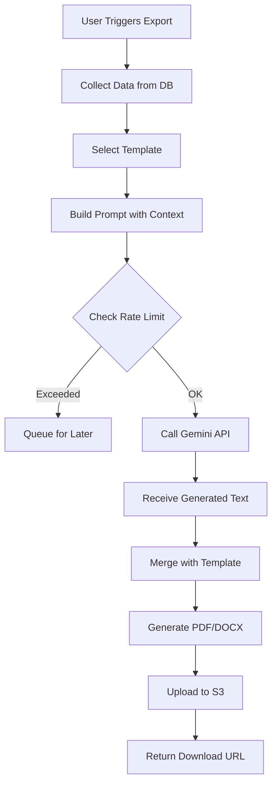
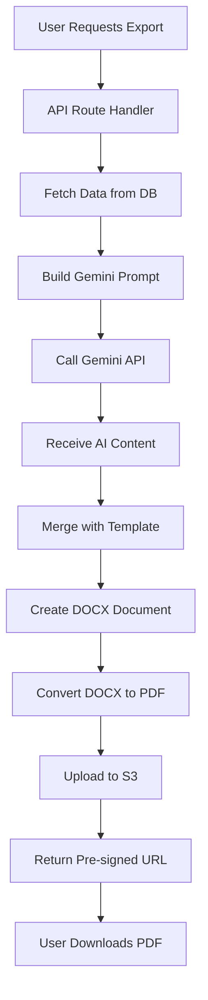

# Gemini Flash 2.0 Integration Guide
## AI-Powered Document Generation for EU AI Act Lab

**Version:** 1.0
**Date:** December 24, 2025
**Status:** Draft

---

## Table of Contents

1. [Overview](#overview)
2. [Gemini Flash 2.0 API Basics](#gemini-flash-20-api-basics)
3. [Document Generation Architecture](#document-generation-architecture)
4. [Prompt Engineering](#prompt-engineering)
5. [Module-Specific Generation](#module-specific-generation)
6. [Document Templates](#document-templates)
7. [PDF Generation Workflow](#pdf-generation-workflow)
8. [Cost Management & Optimization](#cost-management--optimization)
9. [Error Handling & Fallbacks](#error-handling--fallbacks)
10. [Testing & Quality Assurance](#testing--quality-assurance)

---

## Overview

### Purpose

This document specifies how Gemini Flash 2.0 API integration enhances the EU AI Act Implementation Lab by generating professional, regulation-compliant documentation from user inputs.

### Key Capabilities

**Gemini Flash 2.0** is used for:
1. **Executive Summary Generation**: Transform compliance data into narrative summaries
2. **Technical Documentation Enhancement**: Professional formatting and flow
3. **Risk Assessment Narratives**: Convert risk scores into readable assessments
4. **Gap Analysis Reports**: Synthesize compliance gaps into actionable reports
5. **Policy Templates**: Generate customized policy language
6. **Export Document Enhancement**: Add professional introductions, conclusions, recommendations

### Why Gemini Flash 2.0?

| Factor | Benefit |
|--------|---------|
| **Free Tier** | 15 requests/minute, 1,500 requests/day (sufficient for MVP) |
| **Speed** | ~2-3 seconds for typical outputs |
| **Quality** | Good for business documents, regulatory text |
| **Context Window** | 1M tokens input, 8K tokens output |
| **Cost** | Free tier → $0, Paid tier → Very low cost |

---

## Gemini Flash 2.0 API Basics

### API Setup

**Installation:**
```bash
npm install @google/generative-ai
```

**Environment Variables:**
```bash
GEMINI_API_KEY="your-api-key-here"
GEMINI_MODEL="gemini-2.0-flash-exp"
```

**Get API Key:**
1. Visit https://aistudio.google.com/app/apikey
2. Click "Create API Key"
3. Copy key to `.env.local`

### Basic Usage

```typescript
// lib/gemini/client.ts
import { GoogleGenerativeAI } from '@google/generative-ai';

const genAI = new GoogleGenerativeAI(process.env.GEMINI_API_KEY!);

export const geminiModel = genAI.getGenerativeModel({
  model: 'gemini-2.0-flash-exp',
  generationConfig: {
    temperature: 0.7,
    topP: 0.95,
    topK: 40,
    maxOutputTokens: 8192,
  },
});

export async function generateContent(prompt: string): Promise<string> {
  try {
    const result = await geminiModel.generateContent(prompt);
    const response = await result.response;
    return response.text();
  } catch (error) {
    console.error('Gemini API error:', error);
    throw error;
  }
}
```

### Rate Limiting

**Free Tier Limits:**
- 15 requests per minute (RPM)
- 1,500 requests per day (RPD)
- 1 million tokens per minute (TPM)

**Implementation:**
```typescript
// lib/gemini/rate-limiter.ts
import { Ratelimit } from '@upstash/ratelimit';
import { Redis } from '@upstash/redis';

const redis = new Redis({
  url: process.env.REDIS_URL!,
  token: process.env.REDIS_TOKEN!,
});

export const geminiRateLimiter = new Ratelimit({
  redis,
  limiter: Ratelimit.slidingWindow(15, '1 m'), // 15 requests per minute
});

export async function checkGeminiRateLimit(
  userId: string
): Promise<{ success: boolean; remaining: number }> {
  const { success, limit, remaining, reset } =
    await geminiRateLimiter.limit(userId);

  return { success, remaining };
}
```

---

## Document Generation Architecture

### High-Level Flow



### Service Architecture

```typescript
// lib/gemini/document-generator.ts
import { generateContent } from './client';
import { checkGeminiRateLimit } from './rate-limiter';
import { generatePDF } from '../export/pdf-generator';

interface DocumentGenerationRequest {
  userId: string;
  organizationId: string;
  documentType: DocumentType;
  data: Record<string, any>;
  template?: string;
}

export enum DocumentType {
  EXECUTIVE_SUMMARY = 'executive_summary',
  GAP_ANALYSIS = 'gap_analysis',
  RISK_ASSESSMENT = 'risk_assessment',
  TECHNICAL_DOCUMENTATION = 'technical_documentation',
  FULL_PACKAGE = 'full_package',
}

export async function generateDocument(
  request: DocumentGenerationRequest
): Promise<{ fileUrl: string; tokensUsed: number }> {
  // 1. Check rate limit
  const { success, remaining } = await checkGeminiRateLimit(request.userId);
  if (!success) {
    throw new Error('Gemini API rate limit exceeded. Please try again later.');
  }

  // 2. Build prompt based on document type
  const prompt = buildPrompt(request.documentType, request.data);

  // 3. Generate content with Gemini
  const generatedContent = await generateContent(prompt);

  // 4. Merge with template
  const finalDocument = mergeWithTemplate(
    request.documentType,
    generatedContent,
    request.data
  );

  // 5. Generate PDF
  const pdfBuffer = await generatePDF(finalDocument);

  // 6. Upload to S3
  const fileUrl = await uploadToS3(pdfBuffer, request);

  // 7. Track usage
  await trackGeminiUsage(request.userId, generatedContent.length);

  return {
    fileUrl,
    tokensUsed: estimateTokens(generatedContent),
  };
}

function buildPrompt(
  documentType: DocumentType,
  data: Record<string, any>
): string {
  const promptBuilder = promptBuilders[documentType];
  if (!promptBuilder) {
    throw new Error(`No prompt builder for document type: ${documentType}`);
  }
  return promptBuilder(data);
}

function mergeWithTemplate(
  documentType: DocumentType,
  generatedContent: string,
  data: Record<string, any>
): string {
  // Merge AI-generated content with static template sections
  // Implementation in templates section below
  return '';
}
```

---

## Prompt Engineering

### Prompt Structure

Effective prompts follow this structure:

```
1. Role/Context: Define the AI's role and expertise
2. Task: What the AI should generate
3. Input Data: Structured data in JSON format
4. Format: Output format specifications
5. Constraints: Length, tone, regulatory requirements
6. Examples: Few-shot examples (optional)
```

### Best Practices

1. **Be Specific**: Clear instructions produce better results
2. **Provide Context**: Include regulatory references, industry context
3. **Structure Data**: Use JSON for complex inputs
4. **Define Tone**: Professional, formal, technical, etc.
5. **Set Constraints**: Word/character limits, section structure
6. **Include Examples**: Show desired output format

### Temperature Settings

```typescript
const temperatureConfig = {
  factual: 0.2,      // Technical docs, data summaries
  balanced: 0.7,     // Executive summaries, reports (default)
  creative: 1.0,     // Policy suggestions, recommendations
};
```

---

## Module-Specific Generation

### Executive Summary

**Purpose:** Generate a 1-2 page executive narrative from compliance data.

**Prompt Template:**
```typescript
function buildExecutiveSummaryPrompt(data: {
  organizationName: string;
  overallReadiness: number;
  systemsCount: number;
  highRiskSystems: number;
  topGaps: string[];
  topRisks: string[];
  recentActivity: string[];
}): string {
  return `You are an expert compliance consultant specializing in the EU AI Act.

Task: Generate a professional executive summary for a board presentation.

Organization: ${data.organizationName}
Current Date: ${new Date().toLocaleDateString('en-US', { month: 'long', year: 'numeric' })}

Compliance Data (JSON):
${JSON.stringify(data, null, 2)}

Generate a 400-600 word executive summary with the following structure:

1. Opening (1-2 sentences)
   - Current compliance readiness status
   - High-level assessment (excellent/good/needs improvement/critical)

2. Key Achievements (100 words)
   - What has been accomplished
   - Systems assessed and classified
   - Documentation completed

3. Critical Gaps (150 words)
   - Most important compliance gaps
   - Specific regulatory requirements at risk
   - Business impact if not addressed

4. High-Priority Risks (100 words)
   - Top 3 AI-related risks
   - Potential regulatory or business consequences
   - Current mitigation status

5. Recommended Actions (100 words)
   - Top 3-5 immediate actions with specific deadlines
   - Resource requirements
   - Expected impact on readiness score

6. Timeline & Next Steps (50 words)
   - Key milestones for next 3-6 months
   - Target readiness percentage
   - Upcoming regulatory deadlines

Tone: Professional, factual, action-oriented
Audience: C-level executives and board members
Focus: Business impact and regulatory compliance
Avoid: Technical jargon, overly complex explanations

Begin the summary now:`;
}
```

**Example Output:**
```
As of December 2025, TechVision Analytics GmbH has achieved a 72% EU AI Act
compliance readiness score across its portfolio of 4 AI systems, demonstrating
good progress toward regulatory requirements.

Key Achievements
Our organization has successfully completed the foundational compliance steps,
including comprehensive AI system inventory and risk classification for all
deployed systems. Two high-risk systems (Fraud Detection and Resume Screener)
have undergone initial gap assessments, identifying 87% of applicable
requirements. Risk management frameworks have been established for both systems,
with formal governance roles assigned and documented. Additionally, 68% of
required AI literacy training has been completed across all staff roles,
exceeding the industry benchmark of 50% at this stage.

Critical Gaps
Three critical compliance gaps require immediate attention. First, technical
documentation for high-risk systems remains incomplete (55% complete),
particularly in the areas of training data governance and validation testing
(Article 11). Second, human oversight mechanisms are partially implemented but
lack documented procedures and effectiveness monitoring (Article 14). Third,
data governance processes need strengthening to meet the EU AI Act's
requirements for data quality, relevance, and bias mitigation (Article 10).
Failure to address these gaps by Q2 2026 could result in regulatory non-
compliance when enforcement begins, potentially leading to fines and operational
restrictions.

[... continued]
```

---

### Gap Analysis Report

**Prompt Template:**
```typescript
function buildGapAnalysisPrompt(data: {
  systemName: string;
  riskCategory: string;
  requirements: Array<{
    category: string;
    title: string;
    status: string;
    evidence: number;
    priority: string;
  }>;
  overallScore: number;
}): string {
  return `You are an EU AI Act compliance auditor.

Task: Analyze compliance gaps for an AI system and generate a detailed gap analysis report section.

AI System: ${data.systemName}
Risk Category: ${data.riskCategory}
Overall Compliance: ${data.overallScore}%

Requirements Status (JSON):
${JSON.stringify(data.requirements, null, 2)}

Generate a gap analysis narrative with these sections:

1. Overview (50 words)
   - Current compliance status
   - Overall assessment

2. Completed Requirements (100 words)
   - List implemented requirements
   - Note evidence quality
   - Highlight strengths

3. In-Progress Requirements (150 words)
   - Requirements currently being implemented
   - Estimated completion timeframes
   - Any blockers or dependencies

4. Critical Gaps (200 words)
   - Not started or partially complete requirements
   - Prioritized by regulatory importance and deadline
   - Specific actions needed
   - Resource requirements
   - Recommended timelines

5. Recommendations (100 words)
   - Top 3-5 prioritized actions
   - Quick wins vs. long-term initiatives
   - Suggested implementation order

Tone: Objective, specific, actionable
Format: Professional audit report
Include: Article references, deadlines, priorities

Begin the gap analysis:`;
}
```

---

### Risk Assessment Narrative

**Prompt Template:**
```typescript
function buildRiskAssessmentPrompt(data: {
  systemName: string;
  risks: Array<{
    title: string;
    type: string;
    inherentScore: number;
    residualScore: number;
    mitigations: string[];
    oversight: string;
  }>;
}): string {
  return `You are an AI risk management expert.

Task: Generate a risk assessment summary for an AI system.

AI System: ${data.systemName}

Risk Data (JSON):
${JSON.stringify(data.risks, null, 2)}

Generate a risk assessment narrative with:

1. Risk Overview (100 words)
   - Total risks identified
   - Risk distribution (high/medium/low)
   - Primary risk categories

2. High-Priority Risks (200 words per risk)
   For each high-priority risk:
   - Risk description in plain language
   - Business and regulatory impact
   - Inherent risk assessment
   - Mitigation strategy and effectiveness
   - Residual risk evaluation
   - Human oversight measures
   - Monitoring approach

3. Risk Treatment Strategy (150 words)
   - Overall approach to risk management
   - Effectiveness of current mitigations
   - Areas needing additional controls
   - Timeline for residual risk reduction

4. Ongoing Monitoring (100 words)
   - Monitoring mechanisms in place
   - Review frequency
   - Responsible parties
   - Escalation procedures

Tone: Professional, risk-focused, balanced
Audience: Risk committee and compliance team
Focus: Clear risk characterization and mitigation effectiveness

Generate the risk assessment:`;
}
```

---

### Technical Documentation

**Prompt Template:**
```typescript
function buildTechnicalDocPrompt(data: {
  systemName: string;
  intendedUse?: string;
  foreseeableMisuse?: string;
  architecture?: string;
  trainingData?: string;
  performance?: string;
  testing?: string;
  oversight?: string;
  cybersecurity?: string;
}): string {
  return `You are a technical writer specializing in AI system documentation for regulatory compliance.

Task: Generate professional introductory and transition text for technical documentation sections.

AI System: ${data.systemName}

User-Provided Content (JSON):
${JSON.stringify(data, null, 2)}

Generate the following:

1. Document Introduction (150 words)
   - Purpose of this technical documentation
   - Regulatory basis (EU AI Act Article 11)
   - Document scope and structure
   - Intended audience

2. Section Transitions (50 words each)
   For each section that has content, generate a brief transition paragraph that:
   - Introduces the section topic
   - Explains its regulatory importance
   - Connects to previous sections

3. Document Conclusion (100 words)
   - Summary of technical characteristics
   - Confirmation of regulatory compliance approach
   - Version control statement
   - Review and update schedule

Tone: Technical, formal, regulatory-appropriate
Style: Clear, structured, professionally worded
Include: Regulatory references, formal language

Generate the document sections:`;
}
```

---

### Policy Generation

**Prompt Template:**
```typescript
function buildPolicyPrompt(data: {
  policyType: string;
  organizationName: string;
  industry: string;
  customSections?: string[];
}): string {
  return `You are a legal and compliance expert drafting corporate AI policies.

Task: Generate a comprehensive ${data.policyType} policy template.

Organization: ${data.organizationName}
Industry: ${data.industry}
Custom Sections: ${data.customSections?.join(', ') || 'Standard sections'}

Generate a formal policy document with:

1. Policy Header
   - Policy title
   - Document control information (version, date, owner)
   - Approval signatures section

2. Purpose & Scope (150 words)
   - Policy objectives
   - Regulatory basis (specific EU AI Act articles)
   - Scope of application
   - Definitions of key terms

3. Policy Statements (300 words)
   - Core principles and requirements
   - Roles and responsibilities
   - Compliance obligations
   - Prohibited practices (if applicable)

4. Implementation Procedures (250 words)
   - How the policy will be implemented
   - Required processes and controls
   - Documentation requirements
   - Training and awareness

5. Monitoring & Review (100 words)
   - Compliance monitoring approach
   - Key performance indicators
   - Review frequency and process
   - Policy update procedures

6. Non-Compliance (100 words)
   - Consequences of policy violations
   - Escalation procedures
   - Remediation requirements

Tone: Formal, authoritative, clear
Style: Corporate policy document
Include: Regulatory references, specific requirements, measurable obligations

Generate the policy:`;
}
```

---

## Document Templates

### Template Structure

Templates combine static content with AI-generated sections:

```typescript
// lib/export/templates/executive-summary.ts
export interface ExecutiveSummaryTemplate {
  coverPage: CoverPageData;
  aiGeneratedSummary: string;
  complianceCharts: ChartData[];
  systemTable: SystemData[];
  riskTable: RiskData[];
  footer: FooterData;
}

export function buildExecutiveSummaryTemplate(
  data: ExecutiveSummaryData,
  aiGeneratedContent: string
): ExecutiveSummaryTemplate {
  return {
    coverPage: {
      title: 'EU AI Act Compliance',
      subtitle: 'Executive Summary',
      organizationName: data.organizationName,
      organizationLogo: data.logoUrl,
      date: new Date().toLocaleDateString(),
      version: '1.0',
      confidentiality: 'Internal Use Only',
    },
    aiGeneratedSummary: aiGeneratedContent,
    complianceCharts: generateComplianceCharts(data),
    systemTable: buildSystemTable(data.systems),
    riskTable: buildRiskTable(data.risks),
    footer: {
      pageNumbers: true,
      companyName: data.organizationName,
      generatedBy: 'EU AI Act Implementation Lab',
    },
  };
}
```

### Using docx Library

```typescript
// lib/export/docx-generator.ts
import {
  Document,
  Paragraph,
  TextRun,
  HeadingLevel,
  AlignmentType,
  Table,
  TableRow,
  TableCell,
  WidthType,
} from 'docx';

export function createExecutiveSummaryDocument(
  template: ExecutiveSummaryTemplate
): Document {
  const doc = new Document({
    sections: [
      {
        properties: {
          page: {
            margin: {
              top: 1440, // 1 inch = 1440 twentieths of a point
              right: 1440,
              bottom: 1440,
              left: 1440,
            },
          },
        },
        headers: {
          default: createHeader(template.coverPage),
        },
        footers: {
          default: createFooter(template.footer),
        },
        children: [
          // Cover page
          ...createCoverPage(template.coverPage),

          // AI-generated executive summary
          new Paragraph({
            text: 'Executive Summary',
            heading: HeadingLevel.HEADING_1,
            spacing: { before: 400, after: 200 },
          }),
          ...splitIntoParag raphs(template.aiGeneratedSummary),

          // Compliance charts
          new Paragraph({
            text: 'Compliance Overview',
            heading: HeadingLevel.HEADING_1,
            spacing: { before: 400, after: 200 },
          }),
          ...createCharts(template.complianceCharts),

          // System table
          new Paragraph({
            text: 'AI Systems Status',
            heading: HeadingLevel.HEADING_1,
            spacing: { before: 400, after: 200 },
          }),
          createSystemTable(template.systemTable),

          // Risk table
          new Paragraph({
            text: 'High-Priority Risks',
            heading: HeadingLevel.HEADING_1,
            spacing: { before: 400, after: 200 },
          }),
          createRiskTable(template.riskTable),
        ],
      },
    ],
  });

  return doc;
}

function splitIntoParagraphs(text: string): Paragraph[] {
  return text.split('\n\n').map(
    (para) =>
      new Paragraph({
        text: para.trim(),
        spacing: { after: 200 },
        alignment: AlignmentType.JUSTIFIED,
      })
  );
}
```

---

## PDF Generation Workflow

### Complete Workflow



### DOCX to PDF Conversion

**Option 1: LibreOffice (Recommended for Server)**
```typescript
// lib/export/docx-to-pdf.ts
import { exec } from 'child_process';
import { promisify } from 'util';
import fs from 'fs/promises';
import path from 'path';

const execAsync = promisify(exec);

export async function convertDocxToPdf(
  docxPath: string,
  outputDir: string
): Promise<string> {
  // Ensure LibreOffice is installed
  // apt-get install libreoffice
  // or docker image with LibreOffice

  const command = `libreoffice --headless --convert-to pdf --outdir ${outputDir} ${docxPath}`;

  try {
    await execAsync(command);

    const pdfFilename = path.basename(docxPath, '.docx') + '.pdf';
    const pdfPath = path.join(outputDir, pdfFilename);

    // Verify PDF was created
    await fs.access(pdfPath);

    return pdfPath;
  } catch (error) {
    console.error('PDF conversion error:', error);
    throw new Error('Failed to convert DOCX to PDF');
  }
}
```

**Option 2: Puppeteer (Alternative)**
```typescript
// lib/export/html-to-pdf.ts
import puppeteer from 'puppeteer';

export async function convertHtmlToPdf(html: string): Promise<Buffer> {
  const browser = await puppeteer.launch({
    headless: true,
    args: ['--no-sandbox', '--disable-setuid-sandbox'],
  });

  const page = await browser.newPage();
  await page.setContent(html, { waitUntil: 'networkidle0' });

  const pdfBuffer = await page.pdf({
    format: 'A4',
    margin: {
      top: '1in',
      right: '1in',
      bottom: '1in',
      left: '1in',
    },
    printBackground: true,
  });

  await browser.close();

  return pdfBuffer;
}
```

### S3 Upload

```typescript
// lib/export/s3-upload.ts
import { S3Client, PutObjectCommand } from '@aws-sdk/client-s3';
import { getSignedUrl } from '@aws-sdk/s3-request-presigner';
import fs from 'fs/promises';

const s3Client = new S3Client({
  region: process.env.S3_REGION!,
  credentials: {
    accessKeyId: process.env.S3_ACCESS_KEY_ID!,
    secretAccessKey: process.env.S3_SECRET_ACCESS_KEY!,
  },
});

export async function uploadPdfToS3(
  pdfPath: string,
  organizationId: string,
  documentType: string
): Promise<string> {
  const fileBuffer = await fs.readFile(pdfPath);
  const fileName = `${documentType}-${Date.now()}.pdf`;
  const key = `organizations/${organizationId}/exports/${fileName}`;

  const command = new PutObjectCommand({
    Bucket: process.env.S3_BUCKET!,
    Key: key,
    Body: fileBuffer,
    ContentType: 'application/pdf',
    Metadata: {
      organizationId,
      documentType,
      generatedAt: new Date().toISOString(),
    },
  });

  await s3Client.send(command);

  // Generate pre-signed URL (expires in 7 days)
  const url = await getSignedUrl(s3Client, command, { expiresIn: 604800 });

  return url;
}
```

---

## Cost Management & Optimization

### Free Tier Monitoring

```typescript
// lib/gemini/usage-tracker.ts
import { prisma } from '../db/prisma';

interface GeminiUsage {
  userId: string;
  date: string; // YYYY-MM-DD
  requestCount: number;
  tokensUsed: number;
}

export async function trackGeminiUsage(
  userId: string,
  tokensUsed: number
): Promise<void> {
  const today = new Date().toISOString().split('T')[0];

  await prisma.geminiUsage.upsert({
    where: {
      userId_date: {
        userId,
        date: today,
      },
    },
    update: {
      requestCount: { increment: 1 },
      tokensUsed: { increment: tokensUsed },
    },
    create: {
      userId,
      date: today,
      requestCount: 1,
      tokensUsed,
    },
  });
}

export async function checkDailyLimit(userId: string): Promise<boolean> {
  const today = new Date().toISOString().split('T')[0];

  const usage = await prisma.geminiUsage.findUnique({
    where: {
      userId_date: {
        userId,
        date: today,
      },
    },
  });

  // Free tier: 1,500 requests/day
  return (usage?.requestCount ?? 0) < 1500;
}
```

### Optimization Strategies

**1. Batch Processing**
```typescript
// Generate multiple sections in a single API call
const sections = ['summary', 'gaps', 'risks'];
const batchPrompt = sections
  .map((section) => `## ${section}\n${buildSectionPrompt(section, data)}`)
  .join('\n\n');

const batchResult = await generateContent(batchPrompt);
```

**2. Caching**
```typescript
// Cache generated content for similar requests
export async function getCachedOrGenerate(
  cacheKey: string,
  prompt: string
): Promise<string> {
  const cached = await redis.get(cacheKey);
  if (cached) {
    return cached;
  }

  const generated = await generateContent(prompt);
  await redis.set(cacheKey, generated, 'EX', 3600); // Cache for 1 hour

  return generated;
}
```

**3. Prompt Optimization**
```typescript
// Reduce input tokens by summarizing data
function optimizeInputData(data: any): any {
  return {
    // Only include essential fields
    systemName: data.name,
    riskCount: data.risks.length,
    topRisks: data.risks.slice(0, 5), // Top 5 only
    // ... other essential fields
  };
}
```

**4. Progressive Enhancement**
```typescript
// Generate basic documents without AI, upgrade later
export async function generateDocument(
  request: DocumentGenerationRequest,
  useAI: boolean = true
): Promise<Document> {
  const staticContent = buildStaticTemplate(request.data);

  if (!useAI) {
    return staticContent;
  }

  const aiEnhanced = await enhanceWithGemini(staticContent, request.data);
  return aiEnhanced;
}
```

---

## Error Handling & Fallbacks

### Retry Logic

```typescript
// lib/gemini/retry.ts
export async function generateWithRetry(
  prompt: string,
  maxRetries: number = 3
): Promise<string> {
  let lastError: Error | null = null;

  for (let attempt = 1; attempt <= maxRetries; attempt++) {
    try {
      const result = await generateContent(prompt);
      return result;
    } catch (error) {
      lastError = error as Error;
      console.error(`Gemini API attempt ${attempt} failed:`, error);

      if (attempt < maxRetries) {
        // Exponential backoff: 1s, 2s, 4s
        await sleep(Math.pow(2, attempt - 1) * 1000);
      }
    }
  }

  throw new Error(
    `Gemini API failed after ${maxRetries} attempts: ${lastError?.message}`
  );
}

function sleep(ms: number): Promise<void> {
  return new Promise((resolve) => setTimeout(resolve, ms));
}
```

### Fallback Templates

```typescript
// lib/export/fallback.ts
export function generateFallbackContent(
  documentType: DocumentType,
  data: any
): string {
  // If Gemini fails, use static templates with placeholders
  const fallbacks = {
    executive_summary: `
      ${data.organizationName} EU AI Act Compliance Summary

      Current Status: ${data.overallReadiness}% compliant
      Systems Assessed: ${data.systemsCount}
      High-Risk Systems: ${data.highRiskSystems}

      This organization has made progress toward EU AI Act compliance.
      Key areas requiring attention: ${data.topGaps.join(', ')}.

      Recommended next steps: Complete gap assessments, implement
      missing controls, and prepare technical documentation.
    `,
    gap_analysis: `
      Gap Analysis: ${data.systemName}
      Risk Category: ${data.riskCategory}
      Overall Compliance: ${data.overallScore}%

      Requirements Status:
      - Implemented: ${data.implementedCount}
      - In Progress: ${data.inProgressCount}
      - Not Started: ${data.notStartedCount}

      Critical gaps have been identified in the areas requiring
      immediate attention to achieve compliance.
    `,
    // ... other fallbacks
  };

  return fallbacks[documentType] || 'Document content not available.';
}
```

### Error Monitoring

```typescript
// lib/gemini/monitoring.ts
import * as Sentry from '@sentry/nextjs';

export async function monitoredGenerate(prompt: string): Promise<string> {
  const transaction = Sentry.startTransaction({
    name: 'gemini_generation',
    op: 'ai.generate',
  });

  try {
    const result = await generateContent(prompt);

    transaction.setStatus('ok');
    transaction.setData('prompt_length', prompt.length);
    transaction.setData('result_length', result.length);

    return result;
  } catch (error) {
    transaction.setStatus('error');
    Sentry.captureException(error, {
      tags: {
        service: 'gemini',
        operation: 'generate',
      },
      extra: {
        promptLength: prompt.length,
      },
    });

    throw error;
  } finally {
    transaction.finish();
  }
}
```

---

## Testing & Quality Assurance

### Unit Tests

```typescript
// lib/gemini/__tests__/document-generator.test.ts
import { describe, it, expect, vi } from 'vitest';
import { generateDocument, DocumentType } from '../document-generator';
import { generateContent } from '../client';

vi.mock('../client');

describe('generateDocument', () => {
  it('should generate executive summary', async () => {
    const mockContent = 'Generated executive summary content...';
    vi.mocked(generateContent).mockResolvedValue(mockContent);

    const result = await generateDocument({
      userId: 'user-123',
      organizationId: 'org-123',
      documentType: DocumentType.EXECUTIVE_SUMMARY,
      data: {
        organizationName: 'Test Corp',
        overallReadiness: 75,
        systemsCount: 4,
      },
    });

    expect(result.fileUrl).toBeDefined();
    expect(result.tokensUsed).toBeGreaterThan(0);
    expect(generateContent).toHaveBeenCalledWith(
      expect.stringContaining('Test Corp')
    );
  });

  it('should handle rate limit errors', async () => {
    vi.mocked(generateContent).mockRejectedValue(
      new Error('Rate limit exceeded')
    );

    await expect(
      generateDocument({
        userId: 'user-123',
        organizationId: 'org-123',
        documentType: DocumentType.EXECUTIVE_SUMMARY,
        data: {},
      })
    ).rejects.toThrow('Rate limit exceeded');
  });
});
```

### Integration Tests

```typescript
// lib/gemini/__tests__/gemini-integration.test.ts
import { describe, it, expect } from 'vitest';
import { generateContent } from '../client';

describe('Gemini API Integration', () => {
  it('should generate content from real API', async () => {
    const prompt = 'Write a one-sentence summary of the EU AI Act.';

    const result = await generateContent(prompt);

    expect(result).toBeDefined();
    expect(result.length).toBeGreaterThan(50);
    expect(result).toContain('AI');
  });

  it('should respect temperature settings', async () => {
    // Test different temperature outputs
    const prompts = [0.2, 0.7, 1.0].map((temp) => ({
      temp,
      prompt: 'Describe a compliance challenge.',
    }));

    // Results should vary with temperature
    // Lower temp = more consistent
    // Higher temp = more creative
  });
});
```

### Quality Checks

```typescript
// lib/gemini/quality-check.ts
export function validateGeneratedContent(content: string): {
  isValid: boolean;
  issues: string[];
} {
  const issues: string[] = [];

  // Check minimum length
  if (content.length < 100) {
    issues.push('Content too short (< 100 characters)');
  }

  // Check for placeholder text
  if (content.includes('[INSERT') || content.includes('TODO')) {
    issues.push('Contains placeholder text');
  }

  // Check for proper structure (headers, paragraphs)
  if (!content.includes('\n\n')) {
    issues.push('Missing paragraph breaks');
  }

  // Check for regulatory references (for compliance docs)
  if (!content.match(/Article \d+/)) {
    issues.push('Missing regulatory references');
  }

  // Check for unprofessional language
  const informalWords = ['gonna', 'wanna', 'ya', 'nope', 'yep'];
  if (informalWords.some((word) => content.toLowerCase().includes(word))) {
    issues.push('Contains informal language');
  }

  return {
    isValid: issues.length === 0,
    issues,
  };
}
```

### Manual Review Process

**1. Sample Testing**
```typescript
// Generate 10 documents, manually review 3
export async function sampleTest(count: number = 10): Promise<void> {
  const results = [];

  for (let i = 0; i < count; i++) {
    const result = await generateDocument(sampleRequest);
    results.push(result);
  }

  // Randomly select 30% for manual review
  const sampleSize = Math.ceil(count * 0.3);
  const samples = results.sort(() => Math.random() - 0.5).slice(0, sampleSize);

  console.log('Review these documents:', samples);
}
```

**2. Quality Metrics**
- Accuracy: Does content match input data?
- Completeness: All required sections present?
- Tone: Professional and appropriate?
- References: Correct regulatory citations?
- Length: Within specified limits?
- Formatting: Proper structure and readability?

---

## API Route Implementation

### Complete Example

```typescript
// app/api/export/executive-summary/route.ts
import { NextRequest, NextResponse } from 'next/server';
import { getServerSession } from 'next-auth';
import { authOptions } from '@/lib/auth';
import { generateDocument, DocumentType } from '@/lib/gemini/document-generator';
import { prisma } from '@/lib/db/prisma';

export async function POST(request: NextRequest) {
  try {
    // 1. Authenticate user
    const session = await getServerSession(authOptions);
    if (!session?.user) {
      return NextResponse.json({ error: 'Unauthorized' }, { status: 401 });
    }

    // 2. Parse request body
    const body = await request.json();
    const { organizationId, includeSystems } = body;

    // 3. Verify user owns organization
    const organization = await prisma.organization.findFirst({
      where: {
        id: organizationId,
        userId: session.user.id,
      },
    });

    if (!organization) {
      return NextResponse.json({ error: 'Not found' }, { status: 404 });
    }

    // 4. Fetch compliance data
    const data = await fetchComplianceData(organizationId, includeSystems);

    // 5. Generate document
    const result = await generateDocument({
      userId: session.user.id,
      organizationId,
      documentType: DocumentType.EXECUTIVE_SUMMARY,
      data,
    });

    // 6. Return download URL
    return NextResponse.json({
      fileUrl: result.fileUrl,
      expiresAt: new Date(Date.now() + 7 * 24 * 60 * 60 * 1000).toISOString(),
      tokensUsed: result.tokensUsed,
    });
  } catch (error) {
    console.error('Export error:', error);

    if (error.message.includes('Rate limit')) {
      return NextResponse.json(
        { error: 'Too many requests. Please try again later.' },
        { status: 429 }
      );
    }

    return NextResponse.json(
      { error: 'Failed to generate document' },
      { status: 500 }
    );
  }
}

async function fetchComplianceData(
  organizationId: string,
  systemIds?: string[]
): Promise<any> {
  const systems = await prisma.aiSystem.findMany({
    where: {
      organizationId,
      ...(systemIds && { id: { in: systemIds } }),
    },
    include: {
      riskClassification: true,
      gapAssessment: {
        include: {
          requirements: true,
        },
      },
      aiRiskRegister: {
        include: {
          risks: {
            include: {
              mitigationActions: true,
            },
          },
        },
      },
      incidents: true,
    },
  });

  // Transform to format expected by prompt builder
  return {
    organizationName: organization.name,
    systemsCount: systems.length,
    highRiskSystems: systems.filter(
      (s) => s.riskClassification?.category === 'HIGH_RISK'
    ).length,
    overallReadiness: calculateOverallReadiness(systems),
    topGaps: extractTopGaps(systems),
    topRisks: extractTopRisks(systems),
    recentActivity: await getRecentActivity(organizationId),
  };
}
```

---

**End of Gemini Flash 2.0 Integration Guide**

*This document provides complete specifications for integrating Gemini Flash 2.0 API to generate professional, AI-enhanced compliance documentation for the EU AI Act Implementation Lab.*
