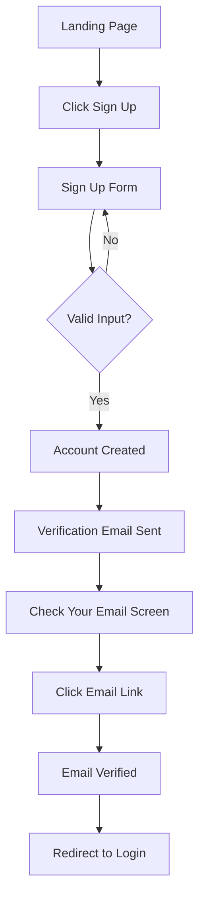
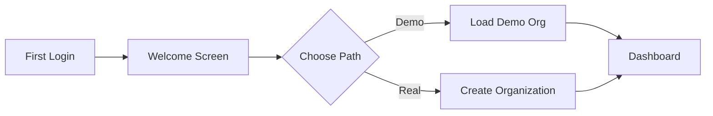
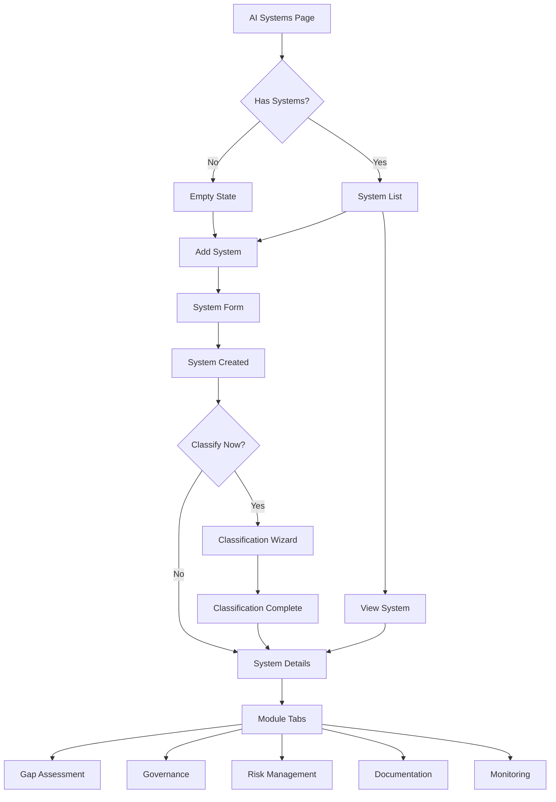

# UI Wireframes & User Flows
## EU AI Act Implementation Lab

**Version:** 1.0
**Date:** December 24, 2025
**Status:** Draft

---

## Table of Contents

1. [Design System](#design-system)
2. [Navigation & Layout](#navigation--layout)
3. [Authentication Flows](#authentication-flows)
4. [Module 1: Organization Setup](#module-1-organization-setup)
5. [Module 2: AI System Inventory & Classification](#module-2-ai-system-inventory--classification)
6. [Module 3: Gap Assessment](#module-3-gap-assessment)
7. [Module 4: AI Governance](#module-4-ai-governance)
8. [Module 5: Risk Management](#module-5-risk-management)
9. [Module 6: Technical Documentation](#module-6-technical-documentation)
10. [Module 7: AI Literacy & Training](#module-7-ai-literacy--training)
11. [Module 8: Incident Logging & Monitoring](#module-8-incident-logging--monitoring)
12. [Module 9: Compliance Dashboard & Export](#module-9-compliance-dashboard--export)
13. [Mobile Responsive Considerations](#mobile-responsive-considerations)

---

## Design System

### Color Palette

**Primary Colors:**
```
Primary Blue:    #2563EB (Blue 600)
Primary Dark:    #1E40AF (Blue 700)
Primary Light:   #3B82F6 (Blue 500)
```

**Semantic Colors:**
```
Success:    #10B981 (Green 500)
Warning:    #F59E0B (Amber 500)
Error:      #EF4444 (Red 500)
Info:       #3B82F6 (Blue 500)
```

**Risk Level Colors:**
```
Prohibited:     #DC2626 (Red 600)
High Risk:      #EA580C (Orange 600)
Limited Risk:   #F59E0B (Amber 500)
Minimal Risk:   #10B981 (Green 500)
```

**Neutral Colors:**
```
Background:     #FFFFFF (White)
Surface:        #F9FAFB (Gray 50)
Border:         #E5E7EB (Gray 200)
Text Primary:   #111827 (Gray 900)
Text Secondary: #6B7280 (Gray 500)
Disabled:       #D1D5DB (Gray 300)
```

### Typography

**Font Family:**
- Primary: `Inter` (sans-serif)
- Monospace: `JetBrains Mono` (for code/data)

**Font Sizes:**
```
H1: 2.25rem (36px) - Page titles
H2: 1.875rem (30px) - Section headers
H3: 1.5rem (24px) - Subsection headers
H4: 1.25rem (20px) - Card titles
Body: 1rem (16px) - Body text
Small: 0.875rem (14px) - Captions, labels
Tiny: 0.75rem (12px) - Hints, metadata
```

**Font Weights:**
```
Regular: 400
Medium: 500
Semibold: 600
Bold: 700
```

### Spacing Scale

```
4px   (0.25rem) - xs
8px   (0.5rem)  - sm
12px  (0.75rem) - base
16px  (1rem)    - md
24px  (1.5rem)  - lg
32px  (2rem)    - xl
48px  (3rem)    - 2xl
64px  (4rem)    - 3xl
```

### Component Styles

**Buttons:**
```
Primary:   Blue 600 bg, white text, hover: Blue 700
Secondary: Gray 200 bg, gray 900 text, hover: Gray 300
Outline:   Transparent bg, blue 600 border, hover: blue 50 bg
Danger:    Red 600 bg, white text, hover: Red 700
Ghost:     Transparent bg, gray 700 text, hover: gray 100 bg

Sizes:
- Small: 32px height, 12px padding
- Medium: 40px height, 16px padding
- Large: 48px height, 20px padding
```

**Cards:**
```
Background: White
Border: 1px solid Gray 200
Border Radius: 8px
Shadow: 0 1px 3px rgba(0, 0, 0, 0.1)
Padding: 24px
```

**Form Inputs:**
```
Height: 40px
Border: 1px solid Gray 300
Border Radius: 6px
Padding: 8px 12px
Focus: Blue 500 ring, 2px offset
Error: Red 500 border
```

### Icons

**Icon Library:** Lucide React (shadcn/ui default)
**Icon Size:** 20px (default), 16px (small), 24px (large)

---

## Navigation & Layout

### Application Layout

```
┌─────────────────────────────────────────────────────────────┐
│  ┌────────────────────────────────────────────────────────┐ │
│  │  Top Navbar                                            │ │
│  │  [Logo] EU AI Act Implementation Lab    [User Menu ▾]  │ │
│  └────────────────────────────────────────────────────────┘ │
│  ┌──────────┬───────────────────────────────────────────┐  │
│  │          │                                           │  │
│  │          │                                           │  │
│  │  Sidebar │  Main Content Area                        │  │
│  │          │                                           │  │
│  │          │                                           │  │
│  │          │                                           │  │
│  │          │                                           │  │
│  │          │                                           │  │
│  │          │                                           │  │
│  └──────────┴───────────────────────────────────────────┘  │
└─────────────────────────────────────────────────────────────┘
```

### Top Navbar

```
┌─────────────────────────────────────────────────────────────┐
│  [⚡ Logo] EU AI Act Implementation Lab                      │
│                                                               │
│                            [🔍 Search...]  [🔔]  [Profile ▾] │
└─────────────────────────────────────────────────────────────┘

User Menu Dropdown:
┌───────────────────┐
│ Sarah Mitchell    │
│ s.mitchell@...    │
├───────────────────┤
│ Organization      │
│ Settings          │
│ Help & Support    │
│ Logout            │
└───────────────────┘
```

### Sidebar Navigation

```
┌────────────────────┐
│                    │
│ 📊 Dashboard       │ ← Active state (blue bg)
│                    │
│ 🏢 Organization    │
│                    │
│ 🤖 AI Systems      │
│   └ 📋 Inventory   │
│   └ ➕ Add System  │
│                    │
│ 📖 Training        │
│                    │
│ 📜 Policies        │
│                    │
│ 📊 Reports         │
│   └ Executive     │
│   └ Gap Analysis  │
│   └ Risk Report   │
│                    │
│ ⚙️  Settings       │
│                    │
└────────────────────┘

Collapsed Sidebar (icon only):
┌──┐
│📊│
│🏢│
│🤖│
│📖│
│📜│
│📊│
│⚙️ │
└──┘
```

### Breadcrumb Navigation

```
Home > AI Systems > Fraud Detection > Gap Assessment
```

---

## Authentication Flows

### Sign Up Flow



### Sign Up Wireframe

```
┌─────────────────────────────────────────────────────────────┐
│                                                               │
│                     Create Your Account                       │
│                                                               │
│  Get started with EU AI Act compliance                        │
│                                                               │
│  ┌───────────────────────────────────────────────────────┐  │
│  │                                                         │  │
│  │  Full Name *                                            │  │
│  │  [_________________________________________]            │  │
│  │                                                         │  │
│  │  Email Address *                                        │  │
│  │  [_________________________________________]            │  │
│  │                                                         │  │
│  │  Password *                                             │  │
│  │  [_________________________________________] [👁️]        │  │
│  │  Must be at least 12 characters                         │  │
│  │                                                         │  │
│  │  Confirm Password *                                     │  │
│  │  [_________________________________________] [👁️]        │  │
│  │                                                         │  │
│  │  ☐ I agree to the Terms of Service and Privacy Policy  │  │
│  │                                                         │  │
│  │                                                         │  │
│  │            [Create Account]                             │  │
│  │                                                         │  │
│  │  ──────────────── or ────────────────                  │  │
│  │                                                         │  │
│  │  [Sign up with Google]  [Sign up with Microsoft]       │  │
│  │                                                         │  │
│  │                                                         │  │
│  │  Already have an account? [Sign In]                    │  │
│  │                                                         │  │
│  └───────────────────────────────────────────────────────┘  │
│                                                               │
└─────────────────────────────────────────────────────────────┘
```

### Email Verification Screen

```
┌─────────────────────────────────────────────────────────────┐
│                                                               │
│                        ✉️                                     │
│                                                               │
│                  Check Your Email                             │
│                                                               │
│  We've sent a verification link to:                           │
│  s.mitchell@example.com                                       │
│                                                               │
│  Click the link in the email to verify your account.          │
│                                                               │
│  Didn't receive the email?                                    │
│  [Resend Verification Email]                                  │
│                                                               │
│  [Back to Sign In]                                            │
│                                                               │
└─────────────────────────────────────────────────────────────┘
```

### Login Wireframe

```
┌─────────────────────────────────────────────────────────────┐
│                                                               │
│                     Welcome Back                              │
│                                                               │
│  Sign in to your account                                      │
│                                                               │
│  ┌───────────────────────────────────────────────────────┐  │
│  │                                                         │  │
│  │  Email Address                                          │  │
│  │  [_________________________________________]            │  │
│  │                                                         │  │
│  │  Password                                               │  │
│  │  [_________________________________________] [👁️]        │  │
│  │                                                         │  │
│  │  ☐ Remember me          [Forgot password?]             │  │
│  │                                                         │  │
│  │                                                         │  │
│  │            [Sign In]                                    │  │
│  │                                                         │  │
│  │  ──────────────── or ────────────────                  │  │
│  │                                                         │  │
│  │  [Sign in with Google]  [Sign in with Microsoft]       │  │
│  │                                                         │  │
│  │                                                         │  │
│  │  Don't have an account? [Sign Up]                      │  │
│  │                                                         │  │
│  └───────────────────────────────────────────────────────┘  │
│                                                               │
└─────────────────────────────────────────────────────────────┘
```

---

## Module 1: Organization Setup

### User Flow



### Welcome Screen

```
┌─────────────────────────────────────────────────────────────┐
│                                                               │
│                  Welcome to EU AI Act Lab! 👋                 │
│                                                               │
│  Let's get you set up. Choose your path:                      │
│                                                               │
│  ┌─────────────────────────┐  ┌─────────────────────────┐   │
│  │                         │  │                         │   │
│  │    🎓 Learn & Practice  │  │  🏢 My Organization     │   │
│  │                         │  │                         │   │
│  │  Load a demo           │  │  Set up my real         │   │
│  │  organization with     │  │  organization and       │   │
│  │  sample AI systems     │  │  start compliance       │   │
│  │                         │  │  work                   │   │
│  │  Perfect for:           │  │                         │   │
│  │  • Learning the tool    │  │  Perfect for:           │   │
│  │  • Following a course   │  │  • Real compliance      │   │
│  │  • Exploring features   │  │  • Production use       │   │
│  │                         │  │                         │   │
│  │  [Load Demo]            │  │  [Create Organization]  │   │
│  │                         │  │                         │   │
│  └─────────────────────────┘  └─────────────────────────┘   │
│                                                               │
└─────────────────────────────────────────────────────────────┘
```

### Organization Setup Form

```
┌─────────────────────────────────────────────────────────────┐
│  ← Back                                                       │
├─────────────────────────────────────────────────────────────┤
│                                                               │
│     Set Up Your Organization                                  │
│                                                               │
│  This information helps tailor compliance requirements        │
│                                                               │
│  ┌───────────────────────────────────────────────────────┐  │
│  │                                                         │  │
│  │  Organization Name *                                    │  │
│  │  [_________________________________]                    │  │
│  │  The legal name of your organization                    │  │
│  │                                                         │  │
│  │  Industry *                                             │  │
│  │  [Select your industry ▾                              ] │  │
│  │  This determines which AI use cases may be high-risk    │  │
│  │                                                         │  │
│  │  Primary Region *                                       │  │
│  │  [Select EU member state ▾                            ] │  │
│  │  Where is your organization primarily located?          │  │
│  │                                                         │  │
│  │  Your Role *                                            │  │
│  │  [Select your role ▾                                  ] │  │
│  │  What's your role in the organization?                  │  │
│  │                                                         │  │
│  │  Organization Logo (Optional)                           │  │
│  │  ┌─────────────────────┐                               │  │
│  │  │                     │ [Upload Image]                │  │
│  │  │  Drag & drop or     │                               │  │
│  │  │  click to upload    │ Max 2MB, PNG or JPG          │  │
│  │  │                     │                               │  │
│  │  └─────────────────────┘                               │  │
│  │                                                         │  │
│  │                                                         │  │
│  │                           [Continue]                    │  │
│  │                                                         │  │
│  └───────────────────────────────────────────────────────┘  │
│                                                               │
└─────────────────────────────────────────────────────────────┘
```

### Setup Complete Screen

```
┌─────────────────────────────────────────────────────────────┐
│                                                               │
│                        ✅                                     │
│                                                               │
│              Organization Created!                            │
│                                                               │
│  TechVision Analytics GmbH is ready for compliance work.      │
│                                                               │
│  Next Steps:                                                  │
│                                                               │
│  1️⃣  Add your first AI system                                 │
│  2️⃣  Classify its risk level                                  │
│  3️⃣  Start gap assessment                                     │
│                                                               │
│                                                               │
│  [Get Started]                                                │
│                                                               │
└─────────────────────────────────────────────────────────────┘
```

---

## Module 2: AI System Inventory & Classification

### User Flow



### AI Systems List (Empty State)

```
┌─────────────────────────────────────────────────────────────┐
│  AI Systems                                   [+ Add System] │
├─────────────────────────────────────────────────────────────┤
│                                                               │
│                                                               │
│                        🤖                                     │
│                                                               │
│                  No AI Systems Yet                            │
│                                                               │
│  Start by adding your organization's first AI system.         │
│  You'll be able to classify it, assess compliance,            │
│  and generate documentation.                                  │
│                                                               │
│                                                               │
│              [+ Add Your First System]                        │
│                                                               │
│              [Load Demo Systems]                              │
│                                                               │
│                                                               │
└─────────────────────────────────────────────────────────────┘
```

### AI Systems List (With Data)

```
┌─────────────────────────────────────────────────────────────┐
│  AI Systems                                   [+ Add System] │
├─────────────────────────────────────────────────────────────┤
│                                                               │
│  Filter: [All Risk Categories ▾] [All Statuses ▾] [Search__] │
│  [Export Inventory ↓]                                         │
│                                                               │
│  ┌───────────────────────────────────────────────────────┐  │
│  │                                                         │  │
│  │  📊 Summary                                             │  │
│  │  Total Systems: 4  |  🔴 0  🟠 2  🟡 1  🟢 1           │  │
│  │                                                         │  │
│  └───────────────────────────────────────────────────────┘  │
│                                                               │
│  ┌───────────────────────────────────────────────────────┐  │
│  │ System Name        Purpose       Risk    Status Updated│  │
│  ├───────────────────────────────────────────────────────┤  │
│  │ 🟠 Fraud Detection Risk mgmt     HIGH    Prod.  Dec 20│  │
│  │    Financial transaction fraud detection               │  │
│  │    [View Details →]                                    │  │
│  ├───────────────────────────────────────────────────────┤  │
│  │ 🟠 Resume Screener HR recruiting HIGH    Test   Dec 18│  │
│  │    Automated resume screening and ranking              │  │
│  │    ⚠️  Classification needed                            │  │
│  │    [View Details →]                                    │  │
│  ├───────────────────────────────────────────────────────┤  │
│  │ 🟡 Customer Chat   Support       LIMITED Prod.  Dec 15│  │
│  │    Customer service chatbot                            │  │
│  │    [View Details →]                                    │  │
│  ├───────────────────────────────────────────────────────┤  │
│  │ 🟢 Product Rec.    Personalize   MINIMAL Prod.  Dec 10│  │
│  │    Product recommendation engine                       │  │
│  │    [View Details →]                                    │  │
│  └───────────────────────────────────────────────────────┘  │
│                                                               │
│  Showing 1-4 of 4                                             │
│                                                               │
└─────────────────────────────────────────────────────────────┘
```

### Add AI System Form

```
┌─────────────────────────────────────────────────────────────┐
│  ← Back to Systems                                            │
├─────────────────────────────────────────────────────────────┤
│                                                               │
│     Add AI System                                             │
│                                                               │
│  Step 1 of 2: System Information                              │
│                                                               │
│  ┌───────────────────────────────────────────────────────┐  │
│  │                                                         │  │
│  │  System Name *                                          │  │
│  │  [_________________________________]                    │  │
│  │  e.g., Customer Service Chatbot                         │  │
│  │                                                         │  │
│  │  Business Purpose *                                     │  │
│  │  ┌─────────────────────────────────────────────────┐   │  │
│  │  │                                                   │   │  │
│  │  │ Describe what this AI system does and why it's   │   │  │
│  │  │ used...                                           │   │  │
│  │  │                                                   │   │  │
│  │  └─────────────────────────────────────────────────┘   │  │
│  │  0 / 500 characters                                     │  │
│  │                                                         │  │
│  │  Primary Users * (check all that apply)                 │  │
│  │  ☐ Internal employees                                   │  │
│  │  ☐ External customers                                   │  │
│  │  ☐ Partners                                             │  │
│  │  ☐ Public                                               │  │
│  │                                                         │  │
│  │  Deployment Status *                                    │  │
│  │  [Planning ▾                                          ] │  │
│  │                                                         │  │
│  │  Data Categories Processed * (check all that apply)     │  │
│  │  ☐ Personal data                                        │  │
│  │  ☐ Sensitive data (race, religion, health, etc.)       │  │
│  │  ☐ Biometric data                                       │  │
│  │  ☐ Financial data                                       │  │
│  │  ☐ Health data                                          │  │
│  │  ☐ Behavioral data                                      │  │
│  │  ☐ Location data                                        │  │
│  │  ☐ No personal data                                     │  │
│  │                                                         │  │
│  │  ──────────── Optional Details ────────────            │  │
│  │                                                         │  │
│  │  System Owner                                           │  │
│  │  [_________________________________]                    │  │
│  │                                                         │  │
│  │  Technical Contact                                      │  │
│  │  [_________________________________]                    │  │
│  │                                                         │  │
│  │                                                         │  │
│  │                        [Cancel]  [Continue]             │  │
│  │                                                         │  │
│  └───────────────────────────────────────────────────────┘  │
│                                                               │
└─────────────────────────────────────────────────────────────┘
```

### Classification Wizard - Step 1

```
┌─────────────────────────────────────────────────────────────┐
│  AI System Classification Wizard                             │
├─────────────────────────────────────────────────────────────┤
│                                                               │
│  System: Fraud Detection                                      │
│                                                               │
│  Progress: ●──○──○──○  Step 1 of 4                           │
│                                                               │
│  ┌───────────────────────────────────────────────────────┐  │
│  │                                                         │  │
│  │  Step 1: Prohibited Practices                           │  │
│  │                                                         │  │
│  │  The EU AI Act prohibits certain AI practices that     │  │
│  │  are considered unacceptable risks to fundamental      │  │
│  │  rights.                                                │  │
│  │                                                         │  │
│  │  Does this AI system perform any of the following?     │  │
│  │                                                         │  │
│  │  ☐ Social scoring by public authorities                │  │
│  │     Evaluating or classifying people based on social   │  │
│  │     behavior or personal characteristics               │  │
│  │                                                         │  │
│  │  ☐ Subliminal manipulation causing harm                │  │
│  │     Using techniques beyond a person's consciousness   │  │
│  │     to materially distort behavior in harmful ways     │  │
│  │                                                         │  │
│  │  ☐ Exploitation of vulnerabilities                     │  │
│  │     Deploying AI that exploits vulnerabilities of      │  │
│  │     specific groups (children, disabilities, etc.)     │  │
│  │                                                         │  │
│  │  ☐ Real-time biometric identification in public        │  │
│  │     Remote biometric identification of people in       │  │
│  │     publicly accessible spaces (with limited law       │  │
│  │     enforcement exceptions)                             │  │
│  │                                                         │  │
│  │  ℹ️ Learn more about Article 5 prohibited practices →  │  │
│  │                                                         │  │
│  │                                                         │  │
│  │                  [Back]  [Next: High-Risk →]            │  │
│  │                                                         │  │
│  └───────────────────────────────────────────────────────┘  │
│                                                               │
└─────────────────────────────────────────────────────────────┘
```

### Classification Wizard - Step 2

```
┌─────────────────────────────────────────────────────────────┐
│  AI System Classification Wizard                             │
├─────────────────────────────────────────────────────────────┤
│                                                               │
│  System: Fraud Detection                                      │
│                                                               │
│  Progress: ●──●──○──○  Step 2 of 4                           │
│                                                               │
│  ┌───────────────────────────────────────────────────────┐  │
│  │                                                         │  │
│  │  Step 2: High-Risk Categories                           │  │
│  │                                                         │  │
│  │  High-risk AI systems are subject to strict           │  │
│  │  compliance requirements.                               │  │
│  │                                                         │  │
│  │  Is this AI system used in any of these areas?         │  │
│  │                                                         │  │
│  │  🔍 Search categories...                                │  │
│  │                                                         │  │
│  │  Biometric Identification & Categorization              │  │
│  │  ☐ Remote biometric identification                     │  │
│  │  ☐ Biometric categorization                            │  │
│  │                                                         │  │
│  │  Critical Infrastructure                                │  │
│  │  ☐ Safety component of critical infrastructure         │  │
│  │                                                         │  │
│  │  Education & Vocational Training                        │  │
│  │  ☐ Determining access to educational institutions      │  │
│  │  ☐ Assessing students in educational settings          │  │
│  │                                                         │  │
│  │  Employment, Workers Management & Self-Employment       │  │
│  │  ☐ Recruitment or selection of persons                 │  │
│  │  ☐ Decisions on promotion, termination, task allocation│  │
│  │  ☐ Monitoring and evaluating performance & behavior    │  │
│  │                                                         │  │
│  │  Essential Private & Public Services                    │  │
│  │  ☐ Creditworthiness assessment / credit scoring        │  │
│  │  ☐ Eligibility for public assistance                   │  │
│  │  ☐ Emergency services dispatch                         │  │
│  │                                                         │  │
│  │  [Show all 8 categories...]                            │  │
│  │                                                         │  │
│  │                  [← Back]  [Next: Transparency →]       │  │
│  │                                                         │  │
│  └───────────────────────────────────────────────────────┘  │
│                                                               │
└─────────────────────────────────────────────────────────────┘
```

### Classification Result

```
┌─────────────────────────────────────────────────────────────┐
│  AI System Classification Wizard                             │
├─────────────────────────────────────────────────────────────┤
│                                                               │
│  System: Fraud Detection                                      │
│                                                               │
│  Progress: ●──●──●──●  Complete                               │
│                                                               │
│  ┌───────────────────────────────────────────────────────┐  │
│  │                                                         │  │
│  │                        ✅                               │  │
│  │                                                         │  │
│  │          Classification Complete                        │  │
│  │                                                         │  │
│  │  ┌───────────────────────────────────────────────┐     │  │
│  │  │                                                 │     │  │
│  │  │  Risk Category: 🟠 HIGH-RISK                    │     │  │
│  │  │                                                 │     │  │
│  │  └───────────────────────────────────────────────┘     │  │
│  │                                                         │  │
│  │  Reasoning:                                             │  │
│  │  This AI system is classified as high-risk because     │  │
│  │  it is used for creditworthiness assessment, which     │  │
│  │  is listed in Annex III of the EU AI Act.              │  │
│  │                                                         │  │
│  │  Applicable Requirements:                               │  │
│  │  ✓ Risk management system (Article 9)                  │  │
│  │  ✓ Data governance (Article 10)                        │  │
│  │  ✓ Technical documentation (Article 11)                │  │
│  │  ✓ Record-keeping (Article 12)                         │  │
│  │  ✓ Transparency (Article 13)                           │  │
│  │  ✓ Human oversight (Article 14)                        │  │
│  │  ✓ Accuracy, robustness, cybersecurity (Article 15)    │  │
│  │                                                         │  │
│  │  Next Steps:                                            │  │
│  │  1. Complete gap assessment                            │  │
│  │  2. Conduct risk assessment                            │  │
│  │  3. Prepare technical documentation                    │  │
│  │                                                         │  │
│  │                                                         │  │
│  │          [View System Details]  [Add Another]          │  │
│  │                                                         │  │
│  └───────────────────────────────────────────────────────┘  │
│                                                               │
└─────────────────────────────────────────────────────────────┘
```

---

## Module 3: Gap Assessment

### System Detail Page with Tabs

```
┌─────────────────────────────────────────────────────────────┐
│  ← Back to Systems                                            │
├─────────────────────────────────────────────────────────────┤
│                                                               │
│  🟠 Fraud Detection System                     [•••]          │
│                                                               │
│  Status: Production  |  Risk: High  |  Readiness: 65%        │
│                                                               │
│  ┌─ Tabs ────────────────────────────────────────────────┐  │
│  │ [Overview] [Gap Assessment] [Governance] [Risk]       │  │
│  │ [Documentation] [Monitoring]                           │  │
│  └────────────────────────────────────────────────────────┘  │
│                                                               │
│  [Tab content appears here...]                                │
│                                                               │
└─────────────────────────────────────────────────────────────┘
```

### Gap Assessment Tab

```
┌─────────────────────────────────────────────────────────────┐
│  Gap Assessment: Fraud Detection                             │
├─────────────────────────────────────────────────────────────┤
│                                                               │
│  Overall Compliance: 65% ▓▓▓▓▓▓▓▓▓▓▓▓▓░░░░░░░              │
│                                                               │
│  Filter: [All Categories ▾] [All Statuses ▾]  [Export ↓]     │
│                                                               │
│  ┌─ Risk Management System ──────────────────────────────┐  │
│  │  4 requirements  |  2 implemented  |  1 in progress     │  │
│  │                                                         │  │
│  │  ✅ Risk management system established                  │  │
│  │     Status: Implemented       Evidence: 2 items         │  │
│  │     Article 9 | Updated: Dec 15, 2025                   │  │
│  │     ▸ View details                                      │  │
│  │                                                         │  │
│  │  ⧗ Continuous risk monitoring processes                 │  │
│  │     Status: In Progress       Evidence: 0 items         │  │
│  │     Article 9 | Updated: Dec 10, 2025                   │  │
│  │     ▾ Details                                           │  │
│  │        Description: Implement ongoing monitoring of     │  │
│  │        identified risks throughout the AI lifecycle.    │  │
│  │                                                         │  │
│  │        Add Evidence:                                    │  │
│  │        [📝 Text Note] [📎 Upload File] [🔗 Add Link]    │  │
│  │                                                         │  │
│  │  ◯ Risk-benefit analysis documentation                  │  │
│  │     Status: Not Started       Evidence: 0 items         │  │
│  │     Article 9 | Not started                             │  │
│  │     ▸ View details                                      │  │
│  │                                                         │  │
│  └─────────────────────────────────────────────────────────┘ │
│                                                               │
│  ┌─ Data Governance ──────────────────────────────────────┐ │
│  │  5 requirements  |  1 implemented  |  2 in progress     │  │
│  │  [Expand ▾]                                             │  │
│  └─────────────────────────────────────────────────────────┘ │
│                                                               │
│  ┌─ Technical Documentation ─────────────────────────────┐  │
│  │  3 requirements  |  0 implemented  |  1 in progress     │  │
│  │  [Expand ▾]                                             │  │
│  └─────────────────────────────────────────────────────────┘ │
│                                                               │
└─────────────────────────────────────────────────────────────┘
```

### Add Evidence Modal

```
┌─────────────────────────────────────────────────────────────┐
│  Add Evidence                                         [✕]    │
├─────────────────────────────────────────────────────────────┤
│                                                               │
│  Requirement: Risk management system established              │
│                                                               │
│  Evidence Type:                                               │
│  ⦿ Text Note    ○ Upload File    ○ Link to URL               │
│                                                               │
│  ┌───────────────────────────────────────────────────────┐  │
│  │                                                         │  │
│  │  Title *                                                │  │
│  │  [Risk Management Policy v1.0___________________]      │  │
│  │                                                         │  │
│  │  Description                                            │  │
│  │  ┌─────────────────────────────────────────────────┐   │  │
│  │  │                                                   │   │  │
│  │  │ Describe this evidence...                         │   │  │
│  │  │                                                   │   │  │
│  │  │                                                   │   │  │
│  │  └─────────────────────────────────────────────────┘   │  │
│  │                                                         │  │
│  │  Evidence Content *                                     │  │
│  │  ┌─────────────────────────────────────────────────┐   │  │
│  │  │                                                   │   │  │
│  │  │ We have established a comprehensive risk          │   │  │
│  │  │ management system for our AI systems according    │   │  │
│  │  │ to Article 9 requirements...                      │   │  │
│  │  │                                                   │   │  │
│  │  │                                                   │   │  │
│  │  └─────────────────────────────────────────────────┘   │  │
│  │  452 / 5000 characters                                  │  │
│  │                                                         │  │
│  │                                                         │  │
│  │                        [Cancel]  [Add Evidence]         │  │
│  │                                                         │  │
│  └───────────────────────────────────────────────────────┘  │
│                                                               │
└─────────────────────────────────────────────────────────────┘
```

---

## Module 4: AI Governance

### Governance Tab - Roles View

```
┌─────────────────────────────────────────────────────────────┐
│  AI Governance: Fraud Detection                              │
├─────────────────────────────────────────────────────────────┤
│                                                               │
│  Tabs: [Roles & Responsibilities] [Policies] [Structure]     │
│                                                               │
│  Assign roles to establish clear accountability              │
│                                                               │
│  ┌─ AI System Owner ──────────────────────────────────────┐ │
│  │                                                         │ │
│  │  Name:       Sarah Mitchell                             │ │
│  │  Email:      s.mitchell@example.com                     │ │
│  │  Department: Risk & Compliance                          │ │
│  │                                                         │ │
│  │  Responsibilities:                                      │ │
│  │  • Overall accountability for AI system                 │ │
│  │  • Approval of major changes                            │ │
│  │  • Escalation point for incidents                       │ │
│  │  • Budget and resource allocation                       │ │
│  │                                                         │ │
│  │  [Edit]  [Remove]                                       │ │
│  │                                                         │ │
│  └─────────────────────────────────────────────────────────┘ │
│                                                               │
│  ┌─ Risk Owner ───────────────────────────────────────────┐ │
│  │                                                         │ │
│  │  Name:       Marcus Chen                                │ │
│  │  Email:      m.chen@example.com                         │ │
│  │  Department: Enterprise Risk                            │ │
│  │                                                         │ │
│  │  [Edit]  [Remove]                                       │ │
│  │                                                         │ │
│  └─────────────────────────────────────────────────────────┘ │
│                                                               │
│  ┌─ Human Oversight Role ─────────────────────────────────┐ │
│  │                                                         │ │
│  │  [+ Assign Person]                                      │ │
│  │                                                         │ │
│  └─────────────────────────────────────────────────────────┘ │
│                                                               │
│  [+ Add Role]                    [Export Responsibility Matrix│
│                                                               │
└─────────────────────────────────────────────────────────────┘
```

### Policies Tab

```
┌─────────────────────────────────────────────────────────────┐
│  AI Governance: Policies                      [+ New Policy] │
├─────────────────────────────────────────────────────────────┤
│                                                               │
│  Organization-wide AI policies                                │
│                                                               │
│  ┌───────────────────────────────────────────────────────┐  │
│  │ Policy                  Status      Version  Updated   │  │
│  ├───────────────────────────────────────────────────────┤  │
│  │ AI Ethics Policy        ✅ Published  v1.0   Dec 20   │  │
│  │ Addresses: Article 4 AI literacy, Article 13 transparency│
│  │ [View] [Edit]                                          │  │
│  ├───────────────────────────────────────────────────────┤  │
│  │ Risk Management Policy  📝 Draft      v0.2   Dec 18   │  │
│  │ Addresses: Article 9 risk management                   │  │
│  │ [View] [Edit] [Publish]                                │  │
│  ├───────────────────────────────────────────────────────┤  │
│  │ Human Oversight Policy  ⧗ Under Rev  v0.5   Dec 15   │  │
│  │ Addresses: Article 14 human oversight                  │  │
│  │ [View] [Edit] [Approve]                                │  │
│  └───────────────────────────────────────────────────────┘  │
│                                                               │
│  Template Library:                                            │
│  [AI Transparency] [Incident Response] [Data Governance]      │
│                                                               │
└─────────────────────────────────────────────────────────────┘
```

---

## Module 5: Risk Management

### Risk Register

```
┌─────────────────────────────────────────────────────────────┐
│  AI Risk Register: Fraud Detection        [+ Add Risk]       │
├─────────────────────────────────────────────────────────────┤
│                                                               │
│  Last assessed: Dec 20, 2025 by Marcus Chen                  │
│                                                               │
│  [View Heat Map]  [Export Risk Report]                        │
│                                                               │
│  Filter: [All Risk Types ▾] [All Risk Levels ▾]              │
│                                                               │
│  ┌────────────────────────────────────────────────────────┐ │
│  │ 🔴 HIGH RISK  |  Risk ID: R-001                         │ │
│  │ Bias in fraud detection against demographic groups     │ │
│  ├────────────────────────────────────────────────────────┤ │
│  │                                                          │ │
│  │ Type: Bias  |  Inherent Risk: L:4 × I:5 = 20 (High)    │ │
│  │                                                          │ │
│  │ Description:                                             │ │
│  │ Training data may not represent diverse customer        │ │
│  │ demographics, leading to higher false positives for     │ │
│  │ certain groups.                                          │ │
│  │                                                          │ │
│  │ Affected Stakeholders:                                   │ │
│  │ External customers, Compliance team                      │ │
│  │                                                          │ │
│  │ ▾ Mitigation Actions (2)                                │ │
│  │                                                          │ │
│  │   ✅ Diverse dataset curation                            │ │
│  │      Responsible: Sarah Mitchell  |  Completed: Dec 10  │ │
│  │      Effectiveness: ●●●●○ (4/5)                         │ │
│  │                                                          │ │
│  │   ⧗ Quarterly bias testing                               │ │
│  │      Responsible: Marcus Chen  |  Due: Mar 31, 2026     │ │
│  │      Status: In Progress (60% complete)                 │ │
│  │                                                          │ │
│  │ Residual Risk: L:2 × I:4 = 8 (Medium) 🟡                │ │
│  │                                                          │ │
│  │ Human Oversight:                                         │ │
│  │ • Frequency: Daily automated bias monitoring            │ │
│  │ • Method: Statistical analysis of decision outcomes     │ │
│  │ • Responsible: Marcus Chen                              │ │
│  │ • Override: Yes, analysts can override flags            │ │
│  │                                                          │ │
│  │ [Edit Risk]  [Add Mitigation]  [View Details]           │ │
│  │                                                          │ │
│  └────────────────────────────────────────────────────────┘ │
│                                                               │
│  ┌────────────────────────────────────────────────────────┐ │
│  │ 🟡 MEDIUM RISK  |  Risk ID: R-002                       │ │
│  │ Model accuracy degradation over time                    │ │
│  │ [Expand ▾]                                              │ │
│  └────────────────────────────────────────────────────────┘ │
│                                                               │
└─────────────────────────────────────────────────────────────┘
```

### Risk Heat Map

```
┌─────────────────────────────────────────────────────────────┐
│  Risk Heat Map                                        [✕]    │
├─────────────────────────────────────────────────────────────┤
│                                                               │
│  View: ⦿ Inherent Risk    ○ Residual Risk                    │
│                                                               │
│  Impact →                                                     │
│  ↑                                                            │
│  L 5 ┌──────┬──────┬──────┬──────┬──────┐                   │
│  i 4 │      │      │      │  ●₁  │  ●₂  │                   │
│  k 3 │      │      │  ●₃  │      │      │                   │
│  e 2 │      │  ●₄  │      │      │      │                   │
│  l 1 │  ●₅  │      │      │      │      │                   │
│  i   └──────┴──────┴──────┴──────┴──────┘                    │
│  h     1      2      3      4      5                          │
│  o                                                            │
│  o   Legend:                                                  │
│  d   ● = Bias     ● = Safety    ● = Privacy                  │
│      ● = Cyber    ● = Other                                   │
│                                                               │
│  Click a risk to view details                                 │
│                                                               │
│  [Export as Image]  [Close]                                   │
│                                                               │
└─────────────────────────────────────────────────────────────┘
```

---

## Module 6: Technical Documentation

### Documentation Tab

```
┌─────────────────────────────────────────────────────────────┐
│  Technical Documentation: Fraud Detection     Version: 1.2   │
├─────────────────────────────────────────────────────────────┤
│                                                               │
│  Completeness: 75% ▓▓▓▓▓▓▓▓▓▓▓▓▓▓▓░░░░░                    │
│  Last saved: 2 minutes ago                                    │
│                                                               │
│  [View Version History]  [Generate Documentation Package]    │
│                                                               │
│  Navigation:                                                  │
│  [1. Intended Use] [2. Foreseeable Misuse] [3. Architecture] │
│  [4. Training Data] [5. Performance] [6. Testing]            │
│  [7. Human Oversight] [8. Cybersecurity]                     │
│                                                               │
│  ┌─ 1. Intended Use ────────────────────────────────────┐   │
│  │                                                        │   │
│  │  ℹ️ Describe the intended purpose, target users,       │   │
│  │     operational environment, and constraints.          │   │
│  │     [View EU AI Act requirements for this section →]   │   │
│  │                                                        │   │
│  │  [Rich text editor with formatting toolbar]            │   │
│  │  ┌──────────────────────────────────────────────────┐ │   │
│  │  │ [B] [I] [U] [•] [1.] [Link] [Table]              │ │   │
│  │  ├──────────────────────────────────────────────────┤ │   │
│  │  │                                                  │ │   │
│  │  │ Intended Purpose                                 │ │   │
│  │  │ The Fraud Detection System is designed to        │ │   │
│  │  │ identify potentially fraudulent financial        │ │   │
│  │  │ transactions in real-time, protecting customers  │ │   │
│  │  │ and the organization from financial loss.        │ │   │
│  │  │                                                  │ │   │
│  │  │ Target Users                                     │ │   │
│  │  │ • Risk analysts and fraud investigators          │ │   │
│  │  │ • Compliance team                                │ │   │
│  │  │ • System administrators                          │ │   │
│  │  │                                                  │ │   │
│  │  │ Operational Environment                          │ │   │
│  │  │ Cloud-based system processing transactions...    │ │   │
│  │  │                                                  │ │   │
│  │  └──────────────────────────────────────────────────┘ │   │
│  │                                                        │   │
│  │  Characters: 842 / 5000 recommended    Auto-save: On   │   │
│  │                                                        │   │
│  │  ── Attachments (2) ─────────────────────────────────  │   │
│  │  📄 System_Architecture_Diagram.pdf      2.1 MB       │   │
│  │     Uploaded Dec 20, 2025 by Sarah Mitchell           │   │
│  │     [Preview] [Download] [Remove]                     │   │
│  │                                                        │   │
│  │  📄 User_Manual_v1.0.docx                 1.8 MB       │   │
│  │     Uploaded Dec 18, 2025 by Marcus Chen              │   │
│  │     [Preview] [Download] [Remove]                     │   │
│  │                                                        │   │
│  │  [+ Add Attachment]                                    │   │
│  │                                                        │   │
│  └────────────────────────────────────────────────────────┘  │
│                                                               │
│  [Previous: —]  [Save]  [Next: Foreseeable Misuse →]        │
│                                                               │
└─────────────────────────────────────────────────────────────┘
```

### Version History Modal

```
┌─────────────────────────────────────────────────────────────┐
│  Version History                                      [✕]    │
├─────────────────────────────────────────────────────────────┤
│                                                               │
│  Technical Documentation: Fraud Detection                     │
│                                                               │
│  ┌───────────────────────────────────────────────────────┐  │
│  │ Version  Date            User            Changes      │  │
│  ├───────────────────────────────────────────────────────┤  │
│  │ ⦿ v1.2   Dec 20, 2025   Sarah Mitchell  (Current)    │  │
│  │         Added cybersecurity section                   │  │
│  │         [View] [Compare]                              │  │
│  ├───────────────────────────────────────────────────────┤  │
│  │   v1.1   Dec 18, 2025   Marcus Chen                  │  │
│  │         Updated training data description             │  │
│  │         [View] [Compare] [Restore]                    │  │
│  ├───────────────────────────────────────────────────────┤  │
│  │   v1.0   Dec 15, 2025   Sarah Mitchell               │  │
│  │         Initial documentation                         │  │
│  │         [View] [Compare] [Restore]                    │  │
│  └───────────────────────────────────────────────────────┘  │
│                                                               │
│  [Close]                                                      │
│                                                               │
└─────────────────────────────────────────────────────────────┘
```

---

## Module 7: AI Literacy & Training

### Training Dashboard

```
┌─────────────────────────────────────────────────────────────┐
│  AI Literacy & Training Compliance                           │
├─────────────────────────────────────────────────────────────┤
│                                                               │
│  Tabs: [Dashboard] [Requirements] [Training Records]         │
│                                                               │
│  Overall Completion: 68% ▓▓▓▓▓▓▓▓▓▓▓▓▓░░░░░░░              │
│                                                               │
│  ┌─ Completion by Role ──────────────────────────────────┐  │
│  │                                                         │  │
│  │  Executives          ▓▓▓▓▓▓▓▓▓▓░░░░░░░░  85% (11/13)  │  │
│  │  Product Teams       ▓▓▓▓▓▓▓▓▓░░░░░░░░░  72% (18/25)  │  │
│  │  Development Teams   ▓▓▓▓▓▓▓▓░░░░░░░░░░  65% (32/49)  │  │
│  │  Operations          ▓▓▓▓▓▓▓░░░░░░░░░░░  58% (7/12)   │  │
│  │  All Staff           ▓▓▓▓▓▓░░░░░░░░░░░░  52% (89/171) │  │
│  │                                                         │  │
│  └─────────────────────────────────────────────────────────┘ │
│                                                               │
│  ┌─ Completion Trend ─────────────────────────────────────┐ │
│  │                                                         │  │
│  │  100% ┤                                                 │  │
│  │   80% ┤              ╱─────                             │  │
│  │   60% ┤         ╱────                                   │  │
│  │   40% ┤    ╱────                                        │  │
│  │   20% ┤────                                             │  │
│  │    0% └────┬────┬────┬────┬────┬────                   │  │
│  │        Sep  Oct  Nov  Dec  Jan  Feb                     │  │
│  │                                                         │  │
│  └─────────────────────────────────────────────────────────┘ │
│                                                               │
│  ┌─ Overdue Training (8) ───────────────────────────────┐   │
│  │  Name              Role         Topic          Due    │   │
│  │  John Smith        Operations   Incident Resp  Nov 30 │   │
│  │  Maria Garcia      Product      AI Limitations Oct 15 │   │
│  │  ...                                                   │   │
│  │  [Send Reminders]                                      │   │
│  └─────────────────────────────────────────────────────────┘ │
│                                                               │
│  [Export Training Report]  [Import Records]                  │
│                                                               │
└─────────────────────────────────────────────────────────────┘
```

---

## Module 8: Incident Logging & Monitoring

### Incident Log

```
┌─────────────────────────────────────────────────────────────┐
│  Incident & Monitoring: Fraud Detection                      │
├─────────────────────────────────────────────────────────────┤
│                                                               │
│  Tabs: [Incident Log] [Monitoring Indicators] [Reports]      │
│                                                               │
│  [+ Report Incident]                          [Export Log]   │
│                                                               │
│  Filter: [All Systems ▾] [All Severities ▾] [All Statuses ▾] │
│                                                               │
│  ┌────────────────────────────────────────────────────────┐ │
│  │ 🔴 CRITICAL | INC-2025-003 | Open                       │ │
│  │ Bias detected in fraud scoring for demographic group    │ │
│  ├────────────────────────────────────────────────────────┤ │
│  │ Reported: Dec 15, 2025 14:32 by Marcus Chen            │ │
│  │ AI System: Fraud Detection System                       │ │
│  │                                                          │ │
│  │ Description:                                             │ │
│  │ Automated monitoring detected significantly higher      │ │
│  │ false positive rate (35% vs. 12% baseline) for          │ │
│  │ customers in demographic segment A-7...                 │ │
│  │                                                          │ │
│  │ Impact: 1,247 customer transactions affected            │ │
│  │                                                          │ │
│  │ Immediate Action: System flagging disabled for review   │ │
│  │                                                          │ │
│  │ ⚠️ Regulatory Notification Assessment Required          │ │
│  │ [Complete Notification Checklist →]                     │ │
│  │                                                          │ │
│  │ ▾ Action Items (3)                                      │ │
│  │   ⧗ Analyze training data demographics    Marcus C.     │ │
│  │      Due: Dec 22, 2025  |  In Progress                  │ │
│  │   ⧗ Retrain model with balanced dataset   Sarah M.      │ │
│  │      Due: Jan 15, 2026  |  Planned                      │ │
│  │   ☐ Document lessons learned              Marcus C.     │ │
│  │      Due: Jan 30, 2026  |  Pending                      │ │
│  │                                                          │ │
│  │ [Update Incident]  [Add Action]  [View Timeline]        │ │
│  │                                                          │ │
│  └────────────────────────────────────────────────────────┘ │
│                                                               │
│  ┌────────────────────────────────────────────────────────┐ │
│  │ 🟡 MEDIUM | INC-2025-002 | Resolved                     │ │
│  │ Accuracy degradation in November processing            │ │
│  │ [Expand ▾]                                              │ │
│  └────────────────────────────────────────────────────────┘ │
│                                                               │
└─────────────────────────────────────────────────────────────┘
```

### Monitoring Indicators Tab

```
┌─────────────────────────────────────────────────────────────┐
│  Monitoring Indicators: Fraud Detection    [+ Add Indicator] │
├─────────────────────────────────────────────────────────────┤
│                                                               │
│  Track key performance and compliance metrics                 │
│                                                               │
│  Filter: [All Categories ▾] [Active Only ▾]                  │
│                                                               │
│  ┌─ Model Accuracy ──────────────────────────────────────┐  │
│  │                                                         │  │
│  │  Current: 94.2%  |  Target: ≥95%  |  ⚠️  Below Target  │  │
│  │  Last measured: Dec 20, 2025 by Automated System       │  │
│  │  Trend: ↓ -1.3% from last month                        │  │
│  │                                                         │  │
│  │  ── History (Last 6 months) ──────────────────────     │  │
│  │  100% ┤                                                 │  │
│  │   98% ┤  ●────●                                         │  │
│  │   96% ┤         ●────●                                  │  │
│  │   94% ┤                 ●────●  ← Current              │  │
│  │   92% ┤                                                 │  │
│  │       └───┬───┬───┬───┬───┬───                         │  │
│  │          Jul Aug Sep Oct Nov Dec                        │  │
│  │                                                         │  │
│  │  [View Full History] [Record New Value] [Edit]         │  │
│  │                                                         │  │
│  └─────────────────────────────────────────────────────────┘ │
│                                                               │
│  ┌─ Bias Metric (Demographic Parity) ────────────────────┐  │
│  │                                                         │  │
│  │  Current: 0.08  |  Target: ≤0.05  |  🔴 Alert         │  │
│  │  Last measured: Dec 20, 2025                           │  │
│  │  Alert triggered: Dec 15, 2025 → Incident INC-2025-003 │  │
│  │                                                         │  │
│  │  [View History] [Record New Value] [Edit]              │  │
│  │                                                         │  │
│  └─────────────────────────────────────────────────────────┘ │
│                                                               │
└─────────────────────────────────────────────────────────────┘
```

---

## Module 9: Compliance Dashboard & Export

### Main Compliance Dashboard

```
┌─────────────────────────────────────────────────────────────┐
│  EU AI Act Compliance Dashboard                              │
├─────────────────────────────────────────────────────────────┤
│                                                               │
│  Date Range: [Last 90 days ▾]                                │
│                                                               │
│  ┌─ Overall Readiness ─────────┐  ┌─ Systems by Risk ─────┐│
│  │                              │  │                        ││
│  │         ╭─────╮              │  │  🔴 Prohibited:    0  ││
│  │        │  72%  │             │  │  🟠 High-risk:     2  ││
│  │        │       │             │  │  🟡 Limited risk:  1  ││
│  │         ╰─────╯              │  │  🟢 Minimal risk:  1  ││
│  │      Good Progress           │  │                        ││
│  │                              │  │  Total: 4 systems     ││
│  │  Target: 80% by Mar 2026     │  │                        ││
│  └──────────────────────────────┘  └────────────────────────┘│
│                                                               │
│  ┌─ Compliance Status ──────────────────────────────────┐   │
│  │ System              Risk    Readiness      Status     │   │
│  │ Fraud Detection     HIGH    ●●●●○○ 65%  🟡           │   │
│  │ Resume Screener     HIGH    ●●●○○○ 55%  🟡           │   │
│  │ Customer Chatbot    LIMITED ●●●●●○ 85%  🟢           │   │
│  │ Product Recomm.     MINIMAL ●●●●●● 95%  🟢           │   │
│  │                                                       │   │
│  │ [View Details]                                        │   │
│  └───────────────────────────────────────────────────────┘   │
│                                                               │
│  ┌─ High Priority Items ────────────────────────────────┐   │
│  │                                                       │   │
│  │ Risks (2 high)                                        │   │
│  │ • Bias in fraud detection           Score: 20 🔴     │   │
│  │ • Resume screening discrimination    Score: 16 🔴     │   │
│  │                                                       │   │
│  │ Gaps (5 critical)                                     │   │
│  │ • Technical documentation incomplete                  │   │
│  │ • Human oversight not fully implemented               │   │
│  │ • Data governance needs improvement                   │   │
│  │                                                       │   │
│  │ Incidents (1 open)                                    │   │
│  │ • INC-2025-003: Bias detection (Critical)            │   │
│  │                                                       │   │
│  └───────────────────────────────────────────────────────┘   │
│                                                               │
│  ┌─ Recent Activity ─────────────────────────────────────┐  │
│  │ Dec 20: Gap assessment updated - Fraud Detection      │  │
│  │ Dec 18: Risk mitigation completed - Resume Screener   │  │
│  │ Dec 15: Incident reported - INC-2025-003              │  │
│  │ Dec 10: Training completed - 15 employees             │  │
│  │ [View All Activity →]                                 │  │
│  └───────────────────────────────────────────────────────┘  │
│                                                               │
│  [Export Executive Summary]  [Export Full Package]           │
│  [View Heat Map]  [Schedule Reports]                         │
│                                                               │
└─────────────────────────────────────────────────────────────┘
```

### Heat Map View

```
┌─────────────────────────────────────────────────────────────┐
│  Compliance Heat Map                                         │
├─────────────────────────────────────────────────────────────┤
│                                                               │
│  Compliance status across all systems and requirement areas  │
│                                                               │
│  System ↓         Risk  Data  Tech  Trans Human Cyber  Monit │
│                   Mgmt  Gov   Doc   par.  Over. Sec.         │
│  ────────────────────────────────────────────────────────────│
│  Fraud Detection   🟡   🔴    🟢    🟢    🟡    🟢    🟡   │
│  Resume Screener   🟡   🟡    🟡    🔴    🟢    🟢    🟢   │
│  Customer Chatbot  🟢   🟢    🟢    🟢    ⬜    🟢    🟢   │
│  Product Recomm.   🟢   🟢    🟢    🟢    ⬜    🟢    🟢   │
│                                                               │
│  Legend:                                                      │
│  🔴 Critical gap / High risk (0-40%)                         │
│  🟡 Partial compliance / Medium risk (41-70%)                │
│  🟢 Compliant / Low risk (71-100%)                           │
│  ⬜ Not applicable                                            │
│                                                               │
│  Click any cell to view details                               │
│                                                               │
│  [Export Heat Map]  [Filter Systems]  [Close]                │
│                                                               │
└─────────────────────────────────────────────────────────────┘
```

### Export Modal

```
┌─────────────────────────────────────────────────────────────┐
│  Export Documentation                                 [✕]    │
├─────────────────────────────────────────────────────────────┤
│                                                               │
│  Choose what to export:                                       │
│                                                               │
│  Export Type:                                                 │
│  ⦿ Executive Summary                                          │
│  ○ Gap Analysis Report                                        │
│  ○ Risk Assessment Report                                     │
│  ○ Full Documentation Package                                 │
│                                                               │
│  ┌───────────────────────────────────────────────────────┐  │
│  │                                                         │  │
│  │  📄 Executive Summary                                   │  │
│  │                                                         │  │
│  │  A concise overview of your organization's EU AI Act   │  │
│  │  compliance readiness, suitable for board              │  │
│  │  presentations and stakeholder updates.                │  │
│  │                                                         │  │
│  │  Includes:                                              │  │
│  │  ✓ Overall readiness score and trends                  │  │
│  │  ✓ System-by-system compliance status                  │  │
│  │  ✓ Key risks and gaps                                  │  │
│  │  ✓ Recommended next steps                              │  │
│  │  ✓ AI-generated executive narrative                    │  │
│  │                                                         │  │
│  │  Estimated pages: 8-12                                  │  │
│  │  Generation time: ~15 seconds                           │  │
│  │                                                         │  │
│  └───────────────────────────────────────────────────────┘  │
│                                                               │
│  Include Systems:                                             │
│  ☑ Fraud Detection System                                    │
│  ☑ Resume Screener                                           │
│  ☑ Customer Chatbot                                          │
│  ☑ Product Recommender                                       │
│                                                               │
│  Format:                                                      │
│  ⦿ PDF    ○ Word (DOCX)                                       │
│                                                               │
│  Branding:                                                    │
│  ☑ Include organization logo                                 │
│  ☑ Use organization colors                                   │
│                                                               │
│                                                               │
│  [Cancel]  [Generate & Download]                             │
│                                                               │
└─────────────────────────────────────────────────────────────┘
```

### Export Progress

```
┌─────────────────────────────────────────────────────────────┐
│  Generating Export...                                        │
├─────────────────────────────────────────────────────────────┤
│                                                               │
│                        ⏳                                     │
│                                                               │
│  Generating Executive Summary                                 │
│                                                               │
│  ✅ Collecting compliance data                                │
│  ✅ Analyzing risk assessments                                │
│  ⧗ Generating AI-powered narrative...                         │
│  ☐ Formatting document                                        │
│  ☐ Creating PDF                                               │
│                                                               │
│  Progress: 60% ▓▓▓▓▓▓▓▓▓▓▓▓░░░░░░░░                         │
│                                                               │
│  Estimated time remaining: 6 seconds                          │
│                                                               │
└─────────────────────────────────────────────────────────────┘
```

### Export Complete

```
┌─────────────────────────────────────────────────────────────┐
│  Export Complete!                                     [✕]    │
├─────────────────────────────────────────────────────────────┤
│                                                               │
│                        ✅                                     │
│                                                               │
│  Your Executive Summary is ready                              │
│                                                               │
│  📄 Executive_Summary_TechVision_Dec2025.pdf                  │
│      File size: 2.4 MB  |  12 pages                           │
│                                                               │
│                                                               │
│              [Download Now]                                   │
│                                                               │
│              [Email to...]                                    │
│                                                               │
│              [Generate Another]                               │
│                                                               │
│                                                               │
│  The download link will expire in 7 days.                     │
│                                                               │
└─────────────────────────────────────────────────────────────┘
```

---

## Mobile Responsive Considerations

### Mobile Navigation (Hamburger Menu)

```
┌─────────────────────┐
│  ☰  EU AI Act Lab   │
│                     │
├─────────────────────┤
│                     │
│  📊 Dashboard       │
│  🏢 Organization    │
│  🤖 AI Systems      │
│  📖 Training        │
│  📜 Policies        │
│  📊 Reports         │
│  ⚙️  Settings       │
│  👤 Profile         │
│                     │
└─────────────────────┘
```

### Mobile Cards (Stacked Layout)

```
┌──────────────────────────┐
│  Fraud Detection         │
│  🟠 High-risk            │
├──────────────────────────┤
│  Status: Production      │
│  Readiness: 65%          │
│  ▓▓▓▓▓▓▓░░░              │
│                          │
│  [View Details →]        │
└──────────────────────────┘

┌──────────────────────────┐
│  Resume Screener         │
│  🟠 High-risk            │
├──────────────────────────┤
│  Status: Testing         │
│  Readiness: 55%          │
│  ▓▓▓▓▓░░░░░              │
│                          │
│  [View Details →]        │
└──────────────────────────┘
```

### Mobile Forms (Full-Width)

```
┌──────────────────────────┐
│  Add AI System           │
├──────────────────────────┤
│                          │
│  System Name *           │
│  [___________________]   │
│                          │
│  Business Purpose *      │
│  ┌──────────────────┐   │
│  │                  │   │
│  │                  │   │
│  └──────────────────┘   │
│                          │
│  Primary Users *         │
│  ☐ Internal employees    │
│  ☐ External customers    │
│  ☐ Partners              │
│  ☐ Public                │
│                          │
│  [Cancel]  [Continue]    │
│                          │
└──────────────────────────┘
```

---

**End of UI Wireframes & User Flows Document**

*This document provides comprehensive UI wireframes and user flow diagrams for all modules of the EU AI Act Implementation Lab. Use these as a reference for implementation with Next.js, Tailwind CSS, and shadcn/ui components.*
